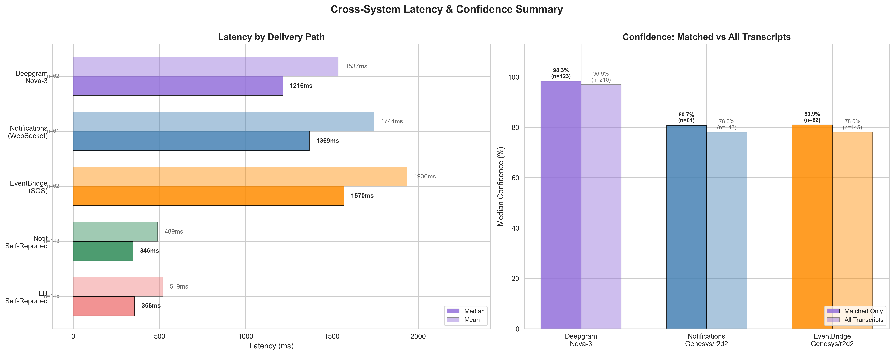
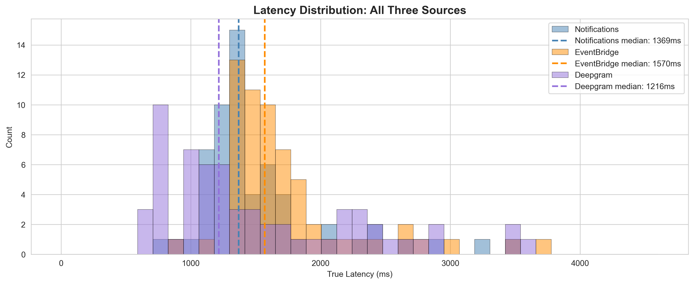
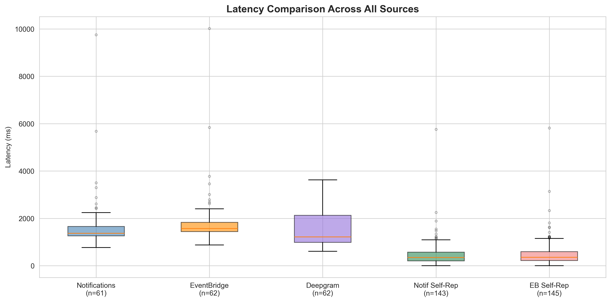
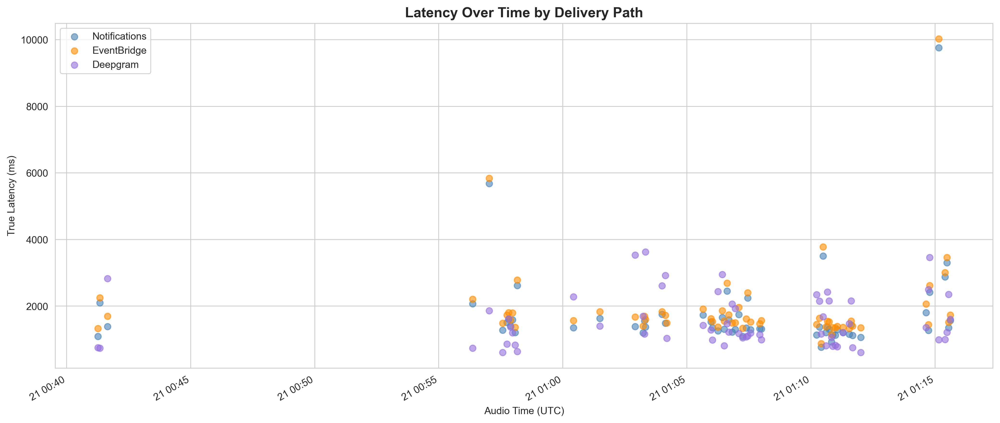
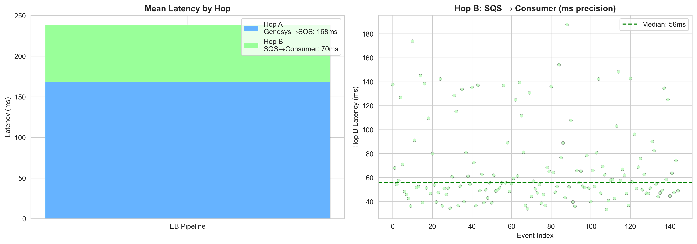
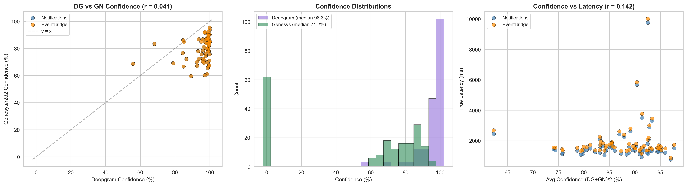

# Executive Summary: Transcription Delivery Path Analysis

**Date**: March 21, 2026
**Scope**: Head-to-head latency and confidence comparison of three transcription delivery paths — Genesys Notifications API (WebSocket), AWS EventBridge (SQS), and Deepgram Direct (POC) — using 6 live test calls with independent ground-truth audio timing.

**Target System**: ~1,200 agents, ~40,000 calls/day, ~6-minute average call duration. Real-time conversation summarization passed to an LLM via MCP server to return agent suggestions during live calls.

---

## Method of Analysis

### Three-Source Cross-System Correlation

A single machine runs three independent transcription capture paths on the same live Genesys call audio simultaneously:

```
Live Genesys Call (agent + customer speaking)
    │
    ├─→ PATH A: Genesys → r2d2 STT → Notifications API (WebSocket) → notifications-spike
    │
    ├─→ PATH B: Genesys → r2d2 STT → EventBridge → SQS → sqs_consumer
    │
    └─→ PATH C: BlackHole audio loopback → Deepgram Nova-3 STT → poc-deepgram
```

**Path C provides ground truth**: Deepgram's `audio_wall_clock_end` tells us the exact wall-clock time each phrase was spoken. Paths A and B record `receivedAt = time.time()` when each transcript event arrives. The difference is the **true end-to-end latency**.

**Matching**: Utterances are correlated across systems using fuzzy text similarity (SequenceMatcher, threshold >= 0.70) within a 15-second temporal window. Each utterance matches at most once per system. 61-62 pairs matched per path from 6 calls covering ~1,300 seconds of audio.

**Formula**:
```
true_latency = receivedAt - deepgram_audio_wall_clock_end
```

Both timestamps are `time.time()` on the same machine — no clock synchronization needed.

---

## Results

### Head-to-Head Latency Comparison

| Source | Median | Mean | p95 | p99 | Min | Max | N |
|--------|-------:|-----:|----:|----:|----:|----:|--:|
| **Deepgram Direct (POC)** | **1,216 ms** | 1,537 ms | 2,947 ms | 3,625 ms | 606 ms | 3,625 ms | 62 |
| **Genesys Notifications (WebSocket)** | **1,369 ms** | 1,744 ms | 3,301 ms | 9,757 ms | 764 ms | 9,757 ms | 61 |
| **Genesys EventBridge (SQS)** | **1,570 ms** | 1,936 ms | 3,457 ms | 10,020 ms | 874 ms | 10,020 ms | 62 |
| Notif Self-Reported | 346 ms | 489 ms | 1,194 ms | 2,250 ms | 0 ms | 5,762 ms | 143 |
| EB Self-Reported | 356 ms | 519 ms | 1,240 ms | 3,138 ms | 0 ms | 5,819 ms | 145 |

**Key ratios**:
- EventBridge adds **+201ms median** over Notifications (1.15x) — the EB delivery hop overhead
- Notifications is **1.13x slower** than Deepgram at the median
- The EB delivery hop (Genesys → SQS → consumer) totals only **238ms median** (individual hop medians: 169ms Genesys→SQS, 56ms SQS→consumer poll)

### Why Self-Reported Latency Is Inaccurate

The self-reported numbers (346ms / 356ms median) dramatically understate true latency. **Self-reported median is 3.96x lower than true Notifications latency and 4.41x lower than true EventBridge latency.** This discrepancy exists because:

1. **Stage 1 is invisible**: Self-reported latency is computed from Genesys's own event metadata (`offsetMs`, `durationMs`, `receivedAt`) using the anchor-event method. This captures Stages 2-4 (STT processing + endpointing + delivery) but **completely misses Stage 1** — the audio capture transport from caller to Genesys Cloud servers (~50-100ms baseline, but variable under load).

2. **Anchor-relative timing zeros out the baseline**: The anchor-event method defines `conversation_start = min(receivedAt - audio_end_offset)` across all events, then measures every event relative to that anchor. The fastest event in each conversation is forced to 0ms. This systematically removes the constant pipeline overhead that every utterance actually experiences.

3. **The gap widens at the tail**: At p95, self-reported shows 1,194ms but true latency is 3,301ms (2.8x). The endpointing batching effect (Stage 3) compounds with the missing baseline, making self-reported metrics progressively more misleading at higher percentiles.

**Bottom line**: Any capacity planning or SLA based on Genesys self-reported latency will be off by 3-4x at the median and worse at the tail. Only cross-system ground-truth measurement captures what the application actually experiences.

`summary_latency_confidence.png`


---

### Latency Distribution

`distribution_overlay.png`


All three sources show right-skewed distributions with primary peaks around 1,000-1,800ms. Deepgram (purple) clusters tightest with the lowest median. EventBridge (orange) tracks Notifications (blue) closely with a consistent ~200ms offset — the EB delivery hop overhead. The tail beyond 5,000ms is driven by endpointing batching during continuous speech, not delivery path differences.

---

### Box Plot Comparison

`boxplot_comparison.png`


The three true end-to-end measurements (Notifications, EventBridge, Deepgram) occupy a similar range with Deepgram having the tightest interquartile spread. Self-reported metrics (green, red) sit far below — illustrating the 3-4x understatement documented above. Outlier dots beyond 5s are endpointing artifacts, not delivery path failures.

---

### Latency Over Time

`timeline_by_source.png`


Scatter plot across all 6 test calls. No systematic drift or degradation over time. EventBridge (orange) consistently tracks above Notifications (blue) by a small offset. Deepgram (purple) runs below both. Spikes correspond to endpointing batching events and appear simultaneously across delivery paths — confirming the bottleneck is Stage 3 (Genesys endpointing), not Stage 4 (delivery).

---

### EventBridge 2-Hop Analysis

`hop_analysis.png`


The EventBridge delivery overhead decomposes into two measurable hops (both with ms-precision timestamps):

| Hop | Median | Mean | p95 |
|-----|-------:|-----:|----:|
| **Hop A**: Genesys → SQS enqueue | 169 ms | 168 ms | 227 ms |
| **Hop B**: SQS → Consumer poll | 56 ms | 70 ms | 142 ms |
| **Total** | 238 ms | 238 ms | 325 ms |

Hop B (SQS poll cycle) can be reduced further by switching to SQS → Lambda trigger or decreasing the poll interval.

---

### Confidence Scores

`confidence_analysis.png`


| Engine | Median (Matched) | Median (All) | N (All) |
|--------|:----------------:|:------------:|:-------:|
| **Deepgram Direct (POC) (Notif-matched)** | 98.3% | 96.9% | 210 |
| **Deepgram Direct (POC) (EB-matched)** | 98.2% | 96.9% | 210 |
| **Genesys r2d2 (Notifications)** | 80.7% | 78.0% | 143 |
| **Genesys r2d2 (EventBridge)** | 80.9% | 78.0% | 145 |

- Deepgram reports **~17 percentage points higher** median confidence than Genesys r2d2 on the same audio
- Genesys confidence drops from 80.7% (matched) to 78.0% (all transcripts) — unmatched utterances tend to be lower quality
- Notifications and EventBridge carry identical Genesys r2d2 confidence values (same STT engine, different delivery)
- Pearson correlation between Deepgram and Genesys confidence is weak — the two engines assess certainty independently

---

## Implications for Production: 1,200 Agents, 40,000 Calls/Day

### The Application

Real-time transcription of ~1,200 concurrent agent conversations. Each utterance is passed to an LLM via MCP server to generate agent suggestions — product recommendations, compliance alerts, knowledge base lookups — while the call is still in progress. The value proposition depends on suggestions arriving while the customer's statement is still contextually relevant.

### Latency Budget for Real-Time LLM Suggestions

```
Total time from customer speaks to agent sees suggestion:
  Stage 1-3: Genesys STT + endpointing        ~1,200-1,600 ms (median)
  Stage 4:   Delivery to our application        ~50-200 ms (WebSocket) or ~240 ms (EventBridge)
  Stage 5:   LLM inference via MCP server       ~500-2,000 ms (depends on model/prompt)
  Stage 6:   Render suggestion in agent UI      ~50-100 ms
  ─────────────────────────────────────────────────────────────────
  Total:                                        ~1,800-3,900 ms typical
```

At median, the customer will have finished speaking 1.8-3.9 seconds before the agent sees a suggestion. For a typical 6-minute call with 20-30 utterances, this is workable — the suggestion arrives during the natural pause while the customer waits for a response.

**At p95 (3.3-3.5s for Stages 1-4 alone)**, add LLM inference time and the suggestion may arrive 4-5.5 seconds after the utterance. For rapid-fire exchanges, this exceeds the window of relevance.

### The +201ms EventBridge Overhead Is Negligible

The EventBridge delivery hop adds 201ms at the median relative to Notifications WebSocket. In the context of a 1.8-3.9 second total pipeline, this is 5-11% of end-to-end latency. The LLM inference stage alone has wider variance than the entire EB vs Notifications gap.

### Why EventBridge Is the Only Viable Path at Scale

The Notifications API has a **hard 1,000 topic limit per WebSocket channel**. Our application requires:

```
  1,200  agent conversation feed topics (static, one per agent)
+   750-1,000  transcription topics (dynamic, at peak)
─────────
= 1,950-2,200  topics needed simultaneously → 2x the limit
```

This forces channel sharding (3-4 WebSocket connections), dynamic topic routing (~80,000 subscribe/unsubscribe API calls/day), 24-hour channel rotation, and a custom recovery mechanism using the analytics API (~8,640 additional API calls/day). Three known bugs were discovered during a 6-call test with 2 agents (multi-participant parsing, stuck state machine on re-route, recovery API incompatible with service credentials). At 1,200 agents and 40,000 calls/day, these edge cases will occur regularly.

EventBridge requires:
- **Zero** per-agent subscriptions
- **Zero** per-conversation subscriptions
- **Zero** Genesys API calls during steady state
- A single EventBridge rule captures all transcription events org-wide
- SQS scales horizontally with standard AWS autoscaling
- SQS retains messages during consumer downtime (up to 14 days)

Genesys themselves state: *"The WebSocket implementation is designed for responsive UI applications. For server-based integrations, the AWS EventBridge integration is recommended."*

### Confidence Score Impact on LLM Quality

Genesys r2d2 reports median 78% confidence across all transcripts. This means roughly 1 in 5 utterances may contain significant transcription errors. For an LLM generating real-time suggestions:

- **Misspelled proper nouns** (product names, customer names) will produce irrelevant knowledge base lookups
- **Misheard intent** ("I want to cancel" vs "I want to keep") can trigger opposite suggestions
- **Low-confidence utterances** should be flagged or excluded from LLM input to prevent hallucinated suggestions based on garbled transcription

The LLM prompt design must account for transcription quality — either by passing confidence scores alongside text, or by implementing a confidence threshold below which utterances are held for clarification rather than acted upon.

### What About AudioHook? (Custom STT via Raw Audio Streaming)

Genesys AudioHook is a third path: instead of receiving transcription text, AudioHook streams **raw call audio** over WebSocket to an external server, where you run your own STT engine (e.g., Deepgram Nova-3). Our Deepgram proxy measurements approximate what an AudioHook deployment would achieve.

**Latency and quality gains:**
- Deepgram Direct (POC): **1,216ms median** (vs. EventBridge 1,570ms, Notifications 1,369ms)
- Deepgram confidence: **98.3% median** (vs. Genesys r2d2 78.0%)
- ~27% faster median delivery and ~20 percentage points higher transcription confidence

**Infrastructure cost to achieve those gains:**

AudioHook requires operating a real-time audio processing pipeline: Gloo Gateway with public TLS certificate, Kubernetes pods on existing clusters, AWS Secrets Manager, S3 for recordings, plus ~500-1,000 lines of custom AudioHook server code. At 1,200 agents (~1,000 concurrent calls), this means ~1,000 simultaneous WebSocket connections and ~256 Mbps inbound audio bandwidth — compared to EventBridge's zero WebSocket connections and ~5 Mbps of text events.

| Dimension | Genesys AudioHook + Deepgram | EventBridge (SQS) |
|-----------|:--------------------:|:-----------------:|
| Median latency | 1,216 ms | 1,570 ms |
| Median confidence | 98.3% | 78.0% (r2d2) |
| Application code | ~500-1,000 lines | ~80 lines |
| WebSocket connections | ~1,000 concurrent | 0 |
| Inbound bandwidth | ~256 Mbps (audio) | ~5 Mbps (text) |
| Infrastructure | Kubernetes pods + Gloo Gateway + S3 + Secrets Manager | 1 SQS queue |
| Additional licensing | Premium AppFoundry (AudioHook Monitor) | Included |
| STT cost | Deepgram subscription (~$0.0043/min) | $0 (Genesys built-in) |
| Failure recovery | Audio lost if WS drops mid-call | SQS retains 4-14 days |

**Feasibility assessment:** AudioHook is technically feasible but represents a 10-50x increase in infrastructure complexity over EventBridge for a 354ms median latency improvement (22% of the pipeline) and a meaningful but not decisive confidence gain. The latency improvement is smaller than the variance of a single LLM inference call. The confidence improvement matters more — 98.3% vs 78.0% directly affects LLM suggestion quality — but can be partially mitigated by confidence-gating r2d2 transcripts at the prompt level.

**Recommendation:** Start with EventBridge. If r2d2's 78% confidence proves insufficient for LLM suggestion quality in production (after tuning prompts and confidence thresholds), AudioHook with Deepgram is the upgrade path. The detailed AudioHook implementation guide is in `docs/audiohook_research.md`.

### Estimated Complexity Comparison (All Three Paths)

| Dimension | EventBridge | Notifications API | Genesys AudioHook + Deepgram |
|-----------|:-----------:|:-----------------:|:--------------------:|
| Application code | ~80 lines (stateless consumer) | ~1,500+ lines (estimated production) | ~500-1,000 lines (AudioHook server + STT) |
| Genesys API calls/day (steady state) | 0 | ~88,640 (subscribe + recovery) | 0 |
| WebSocket connections | 0 | 3-4 concurrent | ~1,000 concurrent (one per call) |
| Inbound bandwidth | ~5 Mbps | ~5 Mbps | ~256 Mbps |
| Failure modes requiring custom code | 1 (consumer crash — SQS retains) | 7+ distinct modes | 2+ (WS drop = lost audio, STT failures) |
| Scaling mechanism | SQS autoscaling (standard AWS) | Channel sharding + rebalancing (custom) | Kubernetes HPA + Gloo Gateway |
| Recovery from downtime | Consumer restarts, drains SQS backlog | Recreate channels, resubscribe all topics, recover missed conversations | No recovery for missed audio; new calls resume automatically |
| Additional cost | $0 | $0 | Premium AppFoundry license + Deepgram STT subscription |

---

## Recommendation

**Use EventBridge (SQS) for the production transcription pipeline.** Reserve AudioHook as an upgrade path if r2d2 confidence proves insufficient.

The 201ms median latency overhead of EventBridge versus Notifications is:
- Within the noise floor of LLM inference variance
- 5-11% of total end-to-end pipeline latency
- A fraction of the endpointing variance that dominates tail latency

The architectural benefits are decisive:
- Eliminates the 1,000 topic limit that makes Notifications non-viable at 1,200 agents
- Removes ~88,640 daily Genesys API calls for topic management and recovery
- Replaces ~1,500 lines of stateful WebSocket management with ~80 lines of stateless SQS consumption
- Eliminates 7+ custom failure-mode handlers
- Aligns with Genesys's own recommendation for server-side integrations
- SQS message retention provides inherent durability that WebSocket fire-and-forget delivery cannot

AudioHook with Deepgram would provide 27% lower latency and 20 percentage points higher confidence, but at 10-50x the infrastructure complexity, additional licensing cost, and a Deepgram STT subscription. It is the right upgrade path **only if** r2d2's transcription quality proves to be a bottleneck for LLM suggestion accuracy in production.

For the LLM/MCP suggestion pipeline, design for:
- **1.8-3.9 second** typical end-to-end latency (STT + delivery + LLM inference)
- **Confidence-gated input**: Pass confidence scores to the LLM prompt or filter utterances below a threshold (~70%) to prevent suggestions based on misheard speech
- **Graceful degradation**: At p95, suggestions may arrive 4-5.5 seconds after the utterance — the UI should indicate staleness for late-arriving suggestions

---

## Data Sources

- **Analysis notebook**: `notebooks/cross_system_latency-02-EB-RESULTS.ipynb`
- **Correlation engine**: `scripts/correlate_latency.py`
- **Exported data**: `analysis_results/cross_system_eb/` (CSV, JSON, PNG)
- **Architectural analysis**: `docs/analysis_key_points.md`
- **Prior single-source analysis**: `docs/analysis.md`
- **Testing learnings**: `docs/notifications_testing_learnings.md`
- **AudioHook implementation guide**: `docs/audiohook_research.md`
