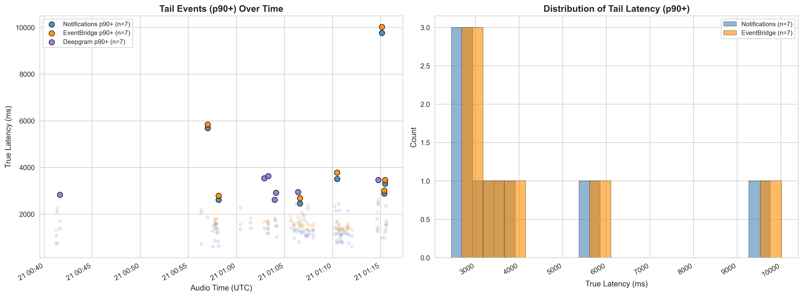
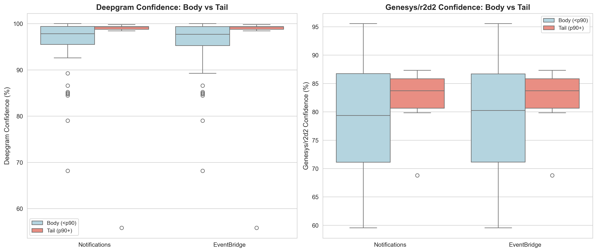

# Transcription Delivery Path Analysis: Percentile Focus (p95 / p99)

**Date**: March 21, 2026
**Scope**: Head-to-head latency comparison of three transcription delivery paths using p95 and p99 as primary metrics. 6 live test calls, 61-62 matched utterance pairs per path, independent ground-truth audio timing.

**Target System**: ~1,200 agents, ~40,000 calls/day, ~6-minute average call duration. At ~20 utterances per call, this produces ~800,000 utterances/day.

---

## Method

Same three-source cross-system correlation as `cross_system_latency-02-EB-RESULTS.ipynb`. Path C (Deepgram Direct via BlackHole loopback -- audio streamed locally to Deepgram Nova-3, not through Genesys) provides ground-truth `audio_wall_clock_end`. True latency = `receivedAt - audio_wall_clock_end`, both `time.time()` on the same machine.

---

## Primary Comparison: p95 and p99

| Source | p99 | p95 | p90 | p50 | N |
|--------|----:|----:|----:|----:|--:|
| **Deepgram Direct (POC)** | **3,569 ms** | **2,945 ms** | 2,598 ms | 1,216 ms | 62 |
| **Genesys Notifications (WebSocket)** | **7,310 ms** | **3,301 ms** | 2,452 ms | 1,369 ms | 61 |
| **Genesys EventBridge (SQS)** | **7,470 ms** | **3,435 ms** | 2,679 ms | 1,570 ms | 62 |

**Note**: "Deepgram Direct" = browser-based POC streaming audio locally to Deepgram Nova-3, bypassing Genesys. See `docs/audiohook_research.md` Executive Summary for estimated Genesys AudioHook latency.

### Inter-Path Deltas at Each Percentile

| Comparison | p99 | p95 | p90 | p75 | p50 |
|------------|----:|----:|----:|----:|----:|
| **Genesys EB - Genesys Notif** | +160 ms | +134 ms | +227 ms | +172 ms | +201 ms |
| **Genesys EB - Deepgram Direct** | +3,901 ms | +490 ms | +81 ms | -300 ms | +354 ms |
| **Genesys Notif - Deepgram Direct** | +3,742 ms | +356 ms | -146 ms | -471 ms | +153 ms |

The Genesys EB-Notifications delta is stable across percentiles (+134ms to +227ms). The Deepgram Direct advantage narrows at p90 but widens dramatically at p99, where Genesys r2d2 endpointing produces outliers that Deepgram's independent STT does not.

---

## Full Percentile Breakdown

| Source | p99 | p95 | p90 | p75 | p50 | Mean | N |
|--------|----:|----:|----:|----:|----:|-----:|--:|
| Deepgram Direct (POC) | 3,569 ms | 2,945 ms | 2,598 ms | 2,128 ms | 1,216 ms | 1,537 ms | 62 |
| Genesys Notifications (WebSocket) | 7,310 ms | 3,301 ms | 2,452 ms | 1,657 ms | 1,369 ms | 1,744 ms | 61 |
| Genesys EventBridge (SQS) | 7,470 ms | 3,435 ms | 2,679 ms | 1,829 ms | 1,570 ms | 1,936 ms | 62 |
| Notif Self-Reported | 2,097 ms | 1,192 ms | 1,010 ms | 568 ms | 346 ms | 489 ms | 143 |
| EB Self-Reported | 2,781 ms | 1,236 ms | 1,071 ms | 594 ms | 356 ms | 519 ms | 145 |

---

## SLA Threshold Exceedance Rates

| Source | >10s | >5s | >3s | >2s | N |
|--------|-----:|----:|----:|----:|--:|
| Deepgram Direct (POC) | 0.0% | 0.0% | 4.8% | 27.4% | 62 |
| Genesys Notifications (WebSocket) | 0.0% | 3.3% | 6.6% | 18.0% | 61 |
| Genesys EventBridge (SQS) | 1.6% | 3.2% | 8.1% | 19.4% | 62 |

At 800,000 utterances/day:
- Genesys EventBridge >5s: 3.2% = ~25,600 utterances/day
- Genesys EventBridge >3s: 8.1% = ~64,800 utterances/day
- Genesys Notifications >5s: 3.3% = ~26,400 utterances/day
- Genesys Notifications >3s: 6.6% = ~52,800 utterances/day
- Deepgram Direct >5s: 0.0% = 0 utterances/day
- Deepgram Direct >3s: 4.8% = ~38,400 utterances/day

`sla_violation_rates.png`


---

## Empirical CDF

`cdf_overlay.png`


The CDF shows the percentage of utterances arriving within a given latency. All three paths deliver >80% of utterances within 2 seconds. The curves diverge beyond 3 seconds: Deepgram Direct reaches 100% by 3.6s, while Genesys Notifications and Genesys EventBridge have long tails extending to 7-10s.

---

## Percentile Bar Chart

`percentile_bars.png`


The Genesys EB-Notifications gap remains relatively constant (134-227ms) across all percentiles. The Deepgram Direct-to-Genesys gap is small at p50-p90 but expands at p99, where Genesys r2d2 endpointing produces outlier latencies that Deepgram Direct does not.

---

## Self-Reported vs True Latency at Percentiles

| Percentile | Notifications True | Notif Self-Reported | Ratio | EventBridge True | EB Self-Reported | Ratio |
|------------|-------------------:|--------------------:|------:|-----------------:|-----------------:|------:|
| p99 | 7,310 ms | 2,097 ms | 3.5x | 7,470 ms | 2,781 ms | 2.7x |
| p95 | 3,301 ms | 1,192 ms | 2.8x | 3,435 ms | 1,236 ms | 2.8x |
| p90 | 2,452 ms | 1,010 ms | 2.4x | 2,679 ms | 1,071 ms | 2.5x |
| p75 | 1,657 ms | 568 ms | 2.9x | 1,829 ms | 594 ms | 3.1x |
| p50 | 1,369 ms | 346 ms | 4.0x | 1,570 ms | 356 ms | 4.4x |

The self-reported understatement ratio is 2.4x-4.4x across all percentiles. The ratio is highest at p50 (self-reported zeros out the baseline via the anchor-event method) and remains >2.4x even at p90.

`self_reported_vs_true_percentiles.png`


---

## EventBridge 2-Hop Decomposition at Percentiles

The EventBridge delivery path passes through two measurable hops before reaching the consumer application. Both hops have millisecond-precision timestamps on each end, allowing exact decomposition:

```
genesysEventTime ──────────────> sqsSentTimestamp ──────────────> receivedAt
       │                                │                              │
       └──────── Hop A ────────────────┘                              │
                Genesys publishes event                               │
                to EventBridge; EB rule                               │
                routes to SQS queue                                   │
                (ms precision ✓)                                      │
                                        └──────── Hop B ─────────────┘
                                                 Consumer long-polls SQS
                                                 (WaitTimeSeconds=20);
                                                 SQS returns immediately
                                                 when a message arrives
                                                 (ms precision ✓)
```

| Hop | p99 | p95 | p90 | p75 | p50 | N |
|-----|----:|----:|----:|----:|----:|--:|
| **Hop A**: Genesys → SQS enqueue | 251 ms | 226 ms | 212 ms | 192 ms | 169 ms | 145 |
| **Hop B**: SQS → Consumer poll | 165 ms | 142 ms | 135 ms | 80 ms | 56 ms | 145 |
| **Total** | 343 ms | 325 ms | 312 ms | 276 ms | 238 ms | 145 |

The EB delivery pipeline (Genesys → SQS → consumer) stays under 350ms even at p99. The p95-to-p99 growth is modest: total increases from 325ms to 343ms (+18ms). The tail latency in EventBridge end-to-end measurements is not caused by the delivery pipeline — it originates in Stages 1-3 (audio capture, r2d2 STT, endpointing).

`hop_percentiles.png`


---

## Tail Latency Deep Dive (p90+)

`tail_latency_deep_dive.png`


Tail events (p90+) appear across multiple conversations rather than clustering in a single session. EventBridge tail events track Notifications tail events at the same timestamps with a consistent offset, confirming the tail is caused by shared upstream stages (r2d2 STT endpointing), not by delivery path differences.

---

## Confidence at the Tail

`confidence_body_vs_tail.png`


| Engine | Median (All) | Median (Matched) | N |
|--------|:------------:|:----------------:|--:|
| Deepgram Direct (Notif-matched) | 96.9% | 98.3% | 61 |
| Deepgram Direct (EB-matched) | 96.9% | 98.2% | 62 |
| Genesys r2d2 (Notifications) | 78.0% | 80.7% | 61 |
| Genesys r2d2 (EventBridge) | 78.0% | 80.9% | 62 |

Confidence scores are independent of delivery path. Notifications and EventBridge carry identical Genesys r2d2 confidence (same STT engine). Deepgram reports ~17 percentage points higher median confidence on the same audio.

---

## Genesys AudioHook Path at Percentiles

The Deepgram Direct POC measurements approximate Genesys AudioHook performance (same STT engine, same audio, but audio did not traverse Genesys infrastructure -- see `docs/audiohook_research.md` Executive Summary for stage-by-stage latency comparison). Key percentile comparisons with EventBridge:

| Metric | Deepgram Direct (measured) | Genesys AudioHook (est. from official docs) | Genesys EventBridge (SQS) |
|--------|:--------------------------:|:------------------------:|:-------------------------:|
| p99 | 3,569 ms | ~3,500 ms | 7,470 ms |
| p95 | 2,945 ms | ~2,870 ms | 3,435 ms |
| p50 | 1,216 ms | ~1,140 ms | 1,570 ms |
| Confidence (median) | 98.3% | 98.3% | 78.0% (r2d2) |
| >3s exceedance | 4.8% | ~4.8% | 8.1% |
| >5s exceedance | 0.0% | ~0% | 3.2% |

At p99, the estimated Genesys AudioHook path delivers in ~3,500ms while Genesys EventBridge delivers in 7,470ms — a ~3,970ms gap. The gap at p95 is smaller (~565ms). The Genesys AudioHook path's ~0% exceedance of 5s vs EventBridge's 3.2% means ~0 utterances/day above 5s vs ~25,600/day for EventBridge at production scale.

### Infrastructure Requirements (Unchanged)

| Dimension | Genesys AudioHook + Deepgram | Genesys EventBridge (SQS) |
|-----------|:----------------------------:|:-------------------------:|
| Application code | ~500-1,000 lines | ~80 lines |
| WebSocket connections | ~1,000 concurrent | 0 |
| Inbound bandwidth | ~256 Mbps (audio) | ~5 Mbps (text) |
| Infrastructure | Kubernetes pods + Gloo Gateway + S3 + Secrets Manager | 1 SQS queue |
| Additional licensing | Premium AppFoundry (AudioHook Monitor) | Included |
| STT cost | Deepgram subscription (~$0.0043/min) | $0 (Genesys built-in) |
| Failure recovery | Audio lost if WS drops mid-call | SQS retains 4-14 days |

---

## Complexity Comparison (All Three Paths)

| Dimension | Genesys EventBridge | Genesys Notifications API | Genesys AudioHook + Deepgram |
|-----------|:-----------:|:-----------------:|:--------------------:|
| Application code | ~80 lines (stateless consumer) | ~1,500+ lines (estimated production) | ~500-1,000 lines (AudioHook server + STT) |
| Genesys API calls/day (steady state) | 0 | ~88,640 (subscribe + recovery) | 0 |
| WebSocket connections | 0 | 3-4 concurrent | ~1,000 concurrent (one per call) |
| Inbound bandwidth | ~5 Mbps | ~5 Mbps | ~256 Mbps |
| Failure modes requiring custom code | 1 (consumer crash — SQS retains) | 7+ distinct modes | 2+ (WS drop = lost audio, STT failures) |
| Scaling mechanism | SQS autoscaling (standard AWS) | Channel sharding + rebalancing (custom) | Kubernetes HPA + Gloo Gateway |
| Recovery from downtime | Consumer restarts, drains SQS backlog | Recreate channels, resubscribe all topics, recover missed conversations | No recovery for missed audio; new calls resume automatically |
| Additional cost | $0 | $0 | Premium AppFoundry license + Deepgram STT subscription |

---

## Latency Budget at p95

```
Total time from customer speaks to agent sees suggestion (p95):
  Stage 1-3: Genesys STT + endpointing        ~3,300-3,435 ms (p95)
  Stage 4:   Delivery to application            ~50-200 ms (WebSocket) or ~325 ms (EventBridge p95)
  Stage 5:   LLM inference via MCP server       ~500-2,000 ms (depends on model/prompt)
  Stage 6:   Render suggestion in agent UI      ~50-100 ms
  ─────────────────────────────────────────────────────────────────
  Total at p95:                                 ~3,900-5,760 ms
```

At p99, Stage 1-3 alone reaches 7,310-7,470ms before LLM inference begins.

---

## Data Sources

- **Analysis notebook**: `notebooks/cross_system_latency-03-PERCENTILE-ANALYSIS.ipynb`
- **Prior median/mean notebook**: `notebooks/cross_system_latency-02-EB-RESULTS.ipynb`
- **Correlation engine**: `scripts/correlate_latency.py`
- **Exported data**: `analysis_results/cross_system_eb_p99/` (CSV, JSON, PNG)
- **AudioHook implementation guide**: `docs/audiohook_research.md`
