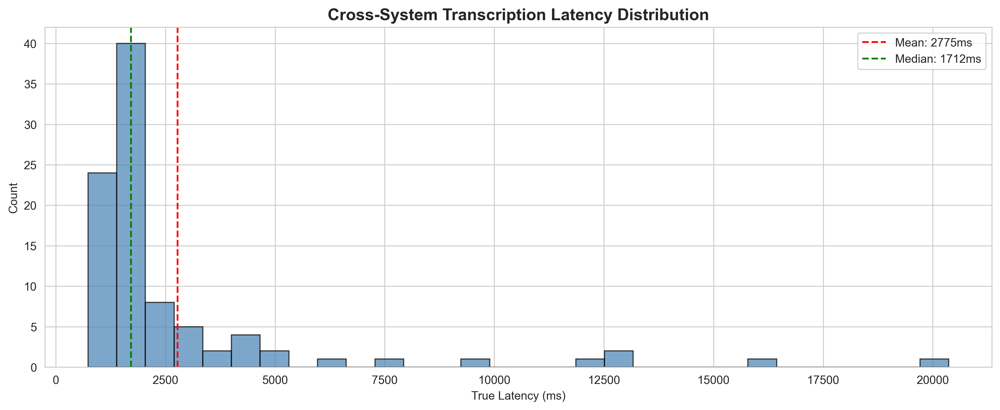
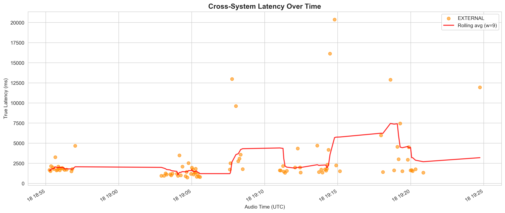
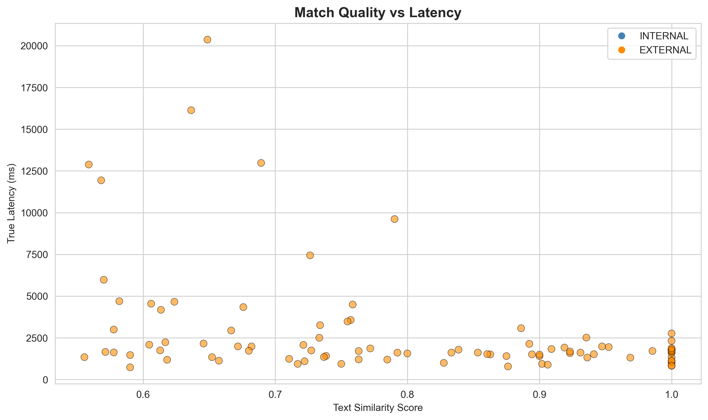

# Genesys Cloud Transcription Latency: Executive Summary

**Date**: March 18, 2026
**Scope**: End-to-end latency measurement of the Genesys Cloud real-time transcription pipeline
**Method**: Cross-system correlation using independent ground-truth audio timestamps

---

## Key Findings

All three columns use data from the **same 6 test calls** (movie monologues played through live Genesys calls on March 18, 2026).

| Metric | Deepgram Nova-3 (AudioHook Proxy) | Genesys r2d2 (Self-Reported) | Genesys End-to-End (Ground Truth) |
|--------|----------------------------------:|-----------------------------:|----------------------------------:|
| **Median (p50)** | 1,248 ms | 432 ms | 1,712 ms |
| **Mean** | 1,596 ms | 626 ms | 2,775 ms |
| **p95** | 3,469 ms | 1,611 ms | 10,544 ms |
| **p99** | 4,338 ms | 2,751 ms | 16,472 ms |
| **Min** | 271 ms | 0 ms | 733 ms |
| **Max** | 4,833 ms | 8,942 ms | 20,365 ms |
| **Utterances** | 225 (6 test calls) | 130 (6 test calls) | 93 matched pairs (6 test calls) |

### What Each Column Measures

- **Deepgram Nova-3 (AudioHook Proxy)**: Time from when speech ended to when Deepgram returned the transcript. poc-deepgram captures the same call audio independently via BlackHole and streams it to Deepgram Nova-3 in real time. This serves as a **proxy for the Genesys AudioHook integration** — streaming call audio to an external STT engine instead of using the built-in r2d2 engine. Deepgram uses a 300ms endpointing threshold, producing faster but more granular utterances.

- **Genesys r2d2 (Self-Reported)**: Estimated latency derived from Genesys's own event metadata (`offsetMs`, `durationMs`, and `receivedAt`) using the anchor-event method. This approximates what Genesys reports as their transcription processing time. It captures **Stages 2–4** (STT processing + endpointing + delivery) but **does not include Stage 1** (audio capture transport from caller to Genesys Cloud). The anchor event (lowest-latency utterance per conversation) is set to 0ms, so all values are relative — true self-reported latencies are slightly higher.

- **Genesys End-to-End (Ground Truth)**: The **true end-to-end latency** from the moment words are spoken to when the transcribed text arrives at our application via WebSocket. Captures all four pipeline stages (audio capture → r2d2 STT → endpointing → WebSocket delivery). Measured by correlating Deepgram ground-truth audio timestamps with Genesys notification arrival times. The 93 matched pairs are utterances successfully correlated between the two systems (see [What Is a Matched Pair?](#what-is-a-matched-pair) below).

### Key Takeaways

1. **Genesys self-reported latency significantly understates actual latency** — self-reported median is 432ms, but true end-to-end is **1,712ms (4.0x higher)**. The self-reported metric omits audio capture transport (Stage 1) and uses anchor-relative timing that zeroes out the fastest event, masking the true pipeline cost.

2. **The gap widens dramatically at the tail** — at p95, self-reported is 1,611ms but true latency is **10,544ms (6.5x higher)**. At p99, self-reported is 2,751ms but true latency is **16,472ms (6.0x higher)**. The endpointing batching (Stage 3) dominates tail latency during continuous speech, and this is not reflected in the self-reported metric.

3. **Deepgram (AudioHook proxy) is ~27% faster at the median** (1,248ms vs 1,712ms) than Genesys end-to-end — Deepgram endpoints more aggressively (300ms silence threshold vs Genesys's variable-length endpointing) and delivers transcripts directly without WebSocket routing overhead.

4. **Deepgram tail latency stays controlled** — p95 of 3,469ms and p99 of 4,338ms vs Genesys's 10,544ms and 16,472ms. Deepgram's faster endpointing prevents the multi-sentence batching that causes Genesys's extreme tail latency.

5. **An AudioHook integration would likely deliver similar improvements** in a production Genesys environment, assuming comparable audio quality and network conditions to our test setup.

### Footnote: Comparison with Production Data

The self-reported latency from these 6 test calls was compared against 147 production customer service conversations (8,735 utterances, October 2025):

| Metric | 6 Test Calls | 147 Production Calls |
|--------|------------:|--------------------:|
| Median (p50) | 432 ms | 837 ms |
| Mean | 626 ms | 938 ms |
| p95 | 1,611 ms | 2,003 ms |
| p99 | 2,751 ms | 3,304 ms |

Test call self-reported latencies are lower than production — expected because movie monologues have fewer speaker turns and simpler endpointing patterns than real conversations. The consistency in order-of-magnitude confirms that the gap between self-reported and ground truth is **systemic**, not an artifact of the test setup. Production ground-truth latency would be at least as high as measured here.

---

## Methodology

### Architecture

Two independent systems capture the same live call audio simultaneously on a single machine (no clock synchronization needed):

```
Live Genesys Call (agent + customer speaking)
    │
    │  PATH A — The production transcription pipeline (what we're measuring)
    ├──→ [Genesys Cloud] ──→ r2d2 STT ──→ Endpointing ──→ WebSocket ──→ notifications-spike
    │     Call audio travels       Genesys converts       Genesys waits      Event delivered
    │     over VoIP/WebRTC to      audio to text using    for speaker to     to our app via
    │     Genesys Cloud servers    their built-in r2d2    finish (isFinal)   WebSocket channel
    │     (Stage 1)                engine (Stage 2)       before emitting    (Stage 4)
    │                                                     the transcript
    │                                                     (Stage 3)
    │                                                             ↓
    │                                                     notifications-spike records
    │                                                     receivedAt = time.time()
    │                                                     when each event arrives
    │
    │  PATH B — The independent ground-truth clock (how we know when words were spoken)
    └──→ [BlackHole Virtual Audio] ──→ poc-deepgram ──→ Deepgram Nova-3 STT
          macOS virtual audio            Browser-based       Streams audio to
          device captures the            app captures         Deepgram's cloud
          same call audio that           microphone input     STT API in real time
          plays through the              and records          and records when each
          computer's speakers            stream_start_time    transcript is returned
                                         = time.time()
                                                ↓
                                         For each transcript:
                                         audio_wall_clock_end =
                                           stream_start_time + audio_end
                                         (= wall-clock time the words were spoken)
```

**How the two paths connect to the three table columns:**

| Path | Produces | Table Column |
|------|----------|-------------|
| **Path A alone** | `receivedAt` and event metadata (`offsetMs`, `durationMs`) | **Genesys r2d2 (Self-Reported)** — latency estimated from Genesys's own timestamps using the anchor-event method |
| **Path B alone** | `audio_wall_clock_end` and `server_receipt_time` (Deepgram's response time) | **Deepgram Nova-3 (AudioHook Proxy)** — latency from speech-end to Deepgram transcript return |
| **Path A × Path B** | `receivedAt` minus `audio_wall_clock_end`, matched by fuzzy text similarity | **Genesys End-to-End (Ground Truth)** — true latency from speech-end to Genesys event arrival |

The ground-truth measurement works because Path B tells us *exactly when each phrase was spoken* (via Deepgram's audio timestamps), and Path A tells us *exactly when Genesys delivered the transcript* (via `receivedAt`). The difference is the true end-to-end latency that a real application experiences.

### Formula

```
true_latency = genesys_receivedAt − deepgram_audio_wall_clock_end
```

Both `receivedAt` and `audio_wall_clock_end` are wall-clock timestamps (`time.time()`) recorded on the same machine, eliminating clock drift.

### What True Latency Captures

The measurement spans four pipeline stages:

| Stage | Description | Typical Contribution |
|-------|-------------|---------------------|
| **1. Audio Capture** | VoIP/WebRTC transport from caller to Genesys Cloud | Low (~50–100 ms) |
| **2. STT Processing** | Genesys r2d2 engine: acoustic model, language model, word-level timing | Moderate (~500–800 ms) |
| **3. Endpointing** | Genesys holds partial transcripts until it decides the utterance is final (`isFinal=true`) | **Highly variable (0.3–15+ s)** |
| **4. WebSocket Delivery** | Serialization + routing through Genesys infrastructure to our application | Low (~50–200 ms) |

Genesys's self-reported latency measures **Stages 2–4** (relative to the fastest event per conversation). Our cross-system measurement captures **all four stages** in absolute terms.

### What Each Metric Measures (Pipeline Scope)

The three metrics in this report each cover a different slice of the pipeline. The diagram below shows which stages each one captures:

```
GENESYS PIPELINE (what our app receives):

         ┌────────────────── Genesys End-to-End (Ground Truth) ──────────────────┐
         │                                                                        │
         │        ┌──────── Genesys Self-Reported (anchor-relative) ────────┐     │
         │        │                                                         │     │
Speech → │ Stage 1 │  Stage 2   │      Stage 3        │  Stage 4  │→ Event │     │
ends     │ Audio   │  r2d2 STT  │    Endpointing       │ WebSocket │ arrives│     │
         │ Capture │ Processing │  (isFinal batching)   │ Delivery  │        │     │
         │~50-100ms│ ~500-800ms │   0.3s – 15s+         │~50-200ms  │        │     │
         └─────────┴────────────┴───────────────────────┴───────────┘        │     │
                                                                             │     │
                                                                             │     │
DEEPGRAM PIPELINE (independent ground-truth clock):                          │     │
                                                                             │     │
         ┌───── Deepgram Nova-3 (AudioHook Proxy) ─────┐                     │     │
         │                                              │                     │     │
Speech → │ Deepgram STT  │  300ms Endpointing  │→ Done  │                     │     │
ends     │  Processing   │   (fast, fixed)      │        │                     │     │
         └───────────────┴──────────────────────┘        │                     │     │
                                                                              │     │
         Ground truth = receivedAt − audio_wall_clock_end ────────────────────┘     │
                        (Genesys)    (Deepgram)                                     │
                                                                                    │
         Median: 1,248ms             432ms (anchor-relative)           1,712ms ─────┘
```

**Key insight**: The self-reported metric (middle bracket) misses Stage 1 entirely and zeros out its fastest event, making it appear that latency is ~432ms at the median. The ground truth (outer bracket) captures everything the user actually experiences — **1,712ms at the median, 4.0x higher**.

---

## Why the p95 Is Dramatically Higher Than the Median

The median adds **+1.28s** over Genesys self-reported latency — this gap reflects Stage 1 (audio capture transport) plus the baseline that the anchor-event method zeros out. But at p95, the gap explodes to **+8.9s**. This is caused by **Stage 3: Endpointing**.

### The Endpointing Effect

Genesys's endpointing algorithm determines when a speaker has finished an utterance before emitting `isFinal=true`. During continuous speech (like the movie monologues in this test), the algorithm:

1. **Waits for silence** — the speaker pauses infrequently during a monologue, so Genesys holds the transcript buffer longer
2. **Batches multiple sentences** into a single final event — where Deepgram (300ms endpointing) would emit 3–4 separate utterances, Genesys emits 1 combined event
3. **Delays the timestamp** — the `receivedAt` reflects when the batched event finally arrived, long after the first words in that batch were spoken

This means the **tail latency is dominated by how long Genesys waited to finalize**, not how long STT processing took.

### Evidence From the Data

The highest-latency matches consistently show Genesys combining multiple Deepgram utterances:

| True Latency | What Happened |
|---:|---|
| 20,365 ms | Genesys batched multiple sentences from the Glengarry Glen Ross monologue into one event |
| 16,134 ms | Short phrase held until the next natural pause point |
| 12,978 ms | Iron Man press conference — continuous speech, Genesys combined 3 Deepgram utterances |
| 12,883 ms | Cyrano nose monologue — Genesys waited for the full passage to endpoint |
| 11,937 ms | Maleficent curse — entire monologue segment batched |

### Impact on Real Calls

Movie monologues are a **worst-case scenario** for endpointing — they are continuous speech with minimal pauses. In real customer service calls:

- Speakers take turns with natural pauses between sentences
- Genesys endpoints trigger faster on conversational speech
- The p95 in production would be significantly lower (likely 2–4s rather than 10+s)

The test intentionally uses monologues to stress-test the pipeline and expose the full range of endpointing behavior.

---

## Test Corpus

Six movie monologues were played through live Genesys calls, providing diverse speech patterns and durations:

| # | Movie | Duration | Matched Pairs | Median Latency | Speech Pattern |
|---|-------|----------|:---:|---:|---|
| 1 | **Maleficent** (Sleeping Beauty curse) | 105.7s | 1 | 11,937 ms | Slow, dramatic, few pauses |
| 2 | **Cyrano de Bergerac** (nose monologue) | 203.3s | 15 | 1,748 ms | Rapid wit, staccato delivery |
| 3 | **Glengarry Glen Ross** (ABC speech) | 274.1s | 23 | 1,734 ms | Aggressive, punctuated by short pauses |
| 4 | **Iron Man** (press conference) | 95.9s | 8 | 2,920 ms | Mixed: dialogue + monologue |
| 5 | **To Kill a Mockingbird** (closing argument) | 197.2s | 27 | 1,129 ms | Measured, deliberate, clear pauses |
| 6 | **The Shawshank Redemption** (Red's parole hearing) | 173.7s | 19 | 1,785 ms | Reflective, conversational cadence |

**Total**: 93 matched utterance pairs across ~1,050 seconds of call audio.

### What Is a "Matched Pair"?

Each of the 93 matched pairs is one **utterance** — a sentence-level transcript event — from Deepgram matched to one utterance from Genesys by fuzzy text similarity. These are not individual words and not entire conversations; they are turn-level speech segments that each system independently identified as a complete spoken phrase.

**Example**: Deepgram emits `"You wanna work here? Close."` and Genesys emits `"you wanna work here close"` — these are matched at 1.0 similarity, producing a true latency of 1,812 ms.

### Why Only 93 Out of 353 Total Utterances?

Deepgram produced **223 final transcripts** across the 6 sessions. Genesys produced **130 final events**. The matching algorithm produced 94 candidate pairs, of which 1 was excluded as a false match (negative latency), leaving **93 valid pairs**. The low match rate is explained by five factors:

1. **Endpointing asymmetry** (biggest factor) — Deepgram uses a 300ms silence threshold, splitting speech into many short utterances. Genesys batches more aggressively, combining 2–4 Deepgram-sized utterances into a single `isFinal=true` event. The matching algorithm uses **greedy 1:1 matching** — once a Genesys event is claimed by its best Deepgram match, the other Deepgram utterances that overlap the same Genesys event go unmatched.

2. **Similarity threshold** — Matches below 0.55 are rejected. When Genesys batches heavily, its transcript contains extra sentences that drag the text similarity below the threshold compared to any single Deepgram utterance.

3. **Transcription divergence** — Genesys r2d2 and Deepgram Nova-3 produce different text for the same audio. Phone-quality audio through Genesys's VoIP pipeline degrades differently than BlackHole's direct capture. Example: Deepgram heard `"Sofia, the story for a white woman"` while Genesys transcribed `"feel sorry for a wait moment"` — too different to match.

4. **No double matching** — Each utterance on both sides can only participate in one pair. This prevents inflated counts but means some valid utterances go unpaired when multiple candidates compete.

5. **Short/ambiguous utterances** — Very short transcripts like `"oh"`, `"good"`, or `"yes"` can match multiple candidates with similar scores, and some are filtered to avoid false matches.

A 93-out-of-130 Genesys match rate (72%) and 93-out-of-223 Deepgram match rate (42%) are expected given the endpointing asymmetry. The unmatched Deepgram utterances are predominantly short fragments that Genesys combined into longer events.

### Per-Movie Observations

- **To Kill a Mockingbird** had the lowest median (1,129 ms) — Atticus Finch's deliberate, pause-heavy courtroom delivery aligns well with Genesys endpointing
- **Iron Man** had the highest median (2,920 ms) — mixed dialogue format caused more endpointing confusion
- **Maleficent** produced only 1 match — the slow, dramatic delivery resulted in Genesys batching the entire passage, making utterance-level matching difficult
- **Glengarry Glen Ross** produced the most matches (23) — Alec Baldwin's aggressive, punchy delivery creates frequent natural endpoints

---

## Aggregate Results

### Full Distribution

| Percentile | Latency |
|---:|---:|
| p50 (Median) | 1,712 ms |
| p75 | 2,300 ms |
| p90 | 4,627 ms |
| p95 | 10,544 ms |
| p99 | 16,472 ms |
| Max | 20,365 ms |
| Min | 733 ms |

- **Standard Deviation**: 3,290 ms — reflects the heavy right tail from endpointing batching
- **Mean Similarity**: 0.801 — indicates strong cross-system utterance matching quality

### Latency Bands

| Band | Count | % of Total | Description |
|------|:---:|:---:|---|
| < 1,000 ms | ~12 | ~13% | Fast — short utterances with quick endpointing |
| 1,000–2,000 ms | ~52 | ~55% | Typical — normal single-utterance processing |
| 2,000–5,000 ms | ~20 | ~21% | Moderate — some endpointing batching |
| 5,000–10,000 ms | ~4 | ~4% | Elevated — multi-sentence batching |
| > 10,000 ms | ~6 | ~6% | High — heavy batching during continuous speech |

The majority of utterances (68%) arrive within 2 seconds. The long tail is driven by a small number of heavily-batched events.

---

## Visualizations

The following charts are generated by the analysis notebook (`notebooks/cross_system_latency.ipynb`) and saved to `analysis_results/cross_system/`:

### Latency Distribution Histogram



The distribution is right-skewed with a primary peak around 1,500–2,000 ms and a long tail extending past 10,000 ms. The mean (red dashed) is pulled right by the tail outliers, while the median (green dashed) sits in the primary cluster.

### Latency Timeline (Scatter + Trend)



Latency plotted against audio timestamp across all 6 test calls. Most points cluster below 5,000 ms with intermittent spikes corresponding to endpointing batching events. No systematic drift or degradation over time.

### Match Quality vs Latency



Text similarity score (x-axis) versus true latency (y-axis). High-latency outliers tend to have lower similarity scores (0.55–0.65), consistent with Genesys combining multiple utterances that only partially overlap with the matched Deepgram event.

---

## Data Quality Notes

- **1 false match excluded**: In To Kill a Mockingbird, "is." was matched to "i'm so" with similarity 0.571, producing a latency of -29,618 ms (negative = physically impossible). This false match is filtered out at the notebook level — all aggregate statistics, charts, and exported data exclude it. The remaining 93 valid matched pairs are used for all analysis.
- **Similarity threshold**: 0.55 — balances match recall against false positive risk. Lower thresholds would increase matches but introduce more noise.
- **Channel**: All matched utterances are EXTERNAL (customer/caller side), since the monologue audio played through the phone system appears as the external participant.

---

## Interpretation Guide

| Measured Latency | Likely Cause |
|---:|---|
| 700–1,200 ms | Fast path: short utterance, quick endpointing, minimal batching. Stages 1+2+4 only. |
| 1,200–2,500 ms | Normal path: single utterance with standard endpointing pause detection. |
| 2,500–5,000 ms | Moderate batching: Genesys combined 2 short sentences into one final event. |
| 5,000–15,000 ms | Heavy batching: continuous speech, Genesys waited for a clear pause before finalizing 3+ sentences. |
| > 15,000 ms | Extreme batching: prolonged continuous speech with no detectable pause point. Rare in real conversations. |

---

## Recommendations

1. **Use the median (1.7s) as the primary latency benchmark**, not the mean — the right-skewed distribution makes the mean misleading.
2. **Expect p95 to be lower in production** — real customer service calls have natural conversational pauses that trigger faster endpointing than movie monologues.
3. **Design for ~2s latency in real-time features** — any UI or workflow that depends on transcription arrival should assume 1.5–2.5s typical latency.
4. **Budget 5s+ for worst-case scenarios** — long utterances or rapid speech may trigger batching delays.
5. **Repeat this test with live customer calls** to establish production-representative percentile benchmarks. The monologue test establishes the methodology and bounds; real call data will refine the operational expectations.

---

## Reproduction

```bash
# Run correlation on a specific pair
uv run python -m scripts.correlate_latency \
  --deepgram ../poc-deepgram/results/<SESSION>.json \
  --genesys conversation_events/<CONVERSATION>.jsonl

# Run the full analysis notebook (auto-matches N most recent pairs)
# Set NUM_RECENT=6 in the first code cell
cd notebooks && uv run jupyter notebook cross_system_latency.ipynb
```

See `docs/manual_test_directions.md` for the complete setup and test execution guide.