# Genesys AudioHook: Implementation Research for 1,200 Agents / 40,000 Calls/Day / 6 minutes per call

**Date**: March 23, 2026
**Purpose**: Comprehensive research on implementing a Genesys AudioHook integration with third-party STT (e.g., Deepgram) for real-time transcription at scale.

---

## Executive Summary

### Latency ([Section 9](#9-audiohook-vs-eventbridge-vs-notifications-api-comparison))

At production scale (~800,000 utterances/day):

| Source | p99 | p95 | p90 | p50 | >5s rate | >5s/day | STT Confidence |
|--------|:---:|:---:|:---:|:---:|:--------:|:-------:|:--------------:|
| **Genesys AudioHook + Deepgram (est. from official docs)** | **~3,500 ms** | **~2,870 ms** | **~2,520 ms** | **~1,140 ms** | **~0%** | **~0** | **98%** |
| Deepgram Direct (measured) [49] | 3,569 ms | 2,945 ms | 2,598 ms | 1,216 ms | 0.0% | 0 | 98% |
| Genesys Notifications WS [49] | 7,310 ms | 3,301 ms | 2,452 ms | 1,369 ms | 3.3% | ~26,400 | 78% |
| Genesys EventBridge SQS [49] | 7,470 ms | 3,435 ms | 2,679 ms | 1,570 ms | 3.2% | ~25,600 | 78% |

Genesys AudioHook estimates are unvalidated -- derived from Deepgram Direct POC measurements adjusted for Genesys infrastructure overhead ([methodology](#deepgram-direct-poc-measurement-methodology-and-limitations-48-49)). Previous analysis showed Genesys reported values to be significantly lower than testing observed ([experiment](https://grainger.atlassian.net/wiki/spaces/CDA/pages/167066828860/Genesys+Notifications+WebSocket+Latency+Experiment+Results)). Validation requires an end-to-end POC with real Genesys call audio.

### Cost ([Section 14](#14-cost-analysis-40000-callsday-6-min-average))

| Component | Monthly Cost |
|-----------|:------------:|
| Genesys AudioHook Monitor | Contact Genesys sales [38] |
| Deepgram Nova-3 (Growth) | $93,600 (enterprise discount likely 40-60% off) |
| Deepgram Nova-2 (Growth) | $67,680 (enterprise discount likely 40-60% off) |
| Infrastructure | Existing Kubernetes clusters + Gloo Gateway |

### Tech Stack ([Section 13](#13-direct-implementation-audiohook--deepgram--llm-no-intermediary))

Python + FastAPI AudioHook server on existing Kubernetes clusters behind Gloo Gateway. Two Deepgram Nova-3 streaming WebSocket connections per call (one per stereo channel). Async capture via SQS → Lambda → S3/DynamoDB.

---

## Table of Contents

- [Executive Summary](#executive-summary)
- [References](#references)
- [1. What Is AudioHook](#1-what-is-audiohook)
  - [Architecture Overview](#architecture-overview-2)
  - [Conversations and Participants](#conversations-and-participants-2)
- [2. Architecture and Protocol](#2-architecture-and-protocol)
  - [WebSocket Protocol](#websocket-protocol)
  - [Audio Specifications](#audio-specifications)
  - [Media Negotiation](#media-negotiation-3)
  - [Bandwidth Calculation](#bandwidth-calculation)
  - [Protocol Message Types](#protocol-message-types)
  - [Session Lifecycle](#session-lifecycle-325-37)
  - [Retry Behavior](#retry-behavior-3)
  - [History Buffer and Catch-Up](#history-buffer-and-catch-up-3)
  - [Sequence Tracking](#sequence-tracking-38-25)
  - [Audio Frame Details](#audio-frame-details-326-28)
  - [Ping and Keepalive](#ping-and-keepalive-3)
  - [Pausing Audio](#pausing-audio-3)
  - [Update Transaction](#update-transaction-3)
  - [Close Transaction](#close-transaction-3)
  - [Connection Probe](#connection-probe-25)
  - [Re-establishing Sessions (Reconnection Protocol)](#re-establishing-sessions-reconnection-protocol-3)
- [3. Authentication and Security](#3-authentication-and-security)
  - [HTTP Signature-Based Authentication](#http-signature-based-authentication-11-12-13-14)
  - [Client Authentication Details (Official Spec)](#client-authentication-details-official-spec-5)
  - [Throttling (Client-Side Flow Control)](#throttling-client-side-flow-control-5)
  - [Rate Limiting (Server to Client)](#rate-limiting-server--client-5)
  - [Other Protocol Limits](#other-protocol-limits-5)
  - [Sensitive Data Handling](#sensitive-data-handling-5)
- [4. TLS and Certificate Requirements](#4-tls-and-certificate-requirements)
- [5. Deployment Architecture](#5-deployment-architecture)
- [6. Scaling Considerations](#6-scaling-considerations)
- [7. AudioHook Monitor Configuration in Genesys](#7-audiohook-monitor-configuration-in-genesys)
  - [Hard Limits](#hard-limits-37-41)
  - [Billing Model](#billing-model-38)
  - [Installation](#installation-35-47)
  - [Step-by-Step Configuration](#step-by-step-configuration-35)
  - [Two Activation Methods for Calls](#two-activation-methods-for-calls-36-37)
  - [Media Language Configuration](#media-language-configuration-40)
  - [PCI DSS Compliance](#pci-dss-compliance-36-37)
- [8. Event Entities (Server to Client)](#8-event-entities-server--client)
- [9. AudioHook vs. EventBridge vs. Notifications API Comparison](#9-audiohook-vs-eventbridge-vs-notifications-api-comparison)
  - [Deepgram Direct POC: Measurement Methodology and Limitations](#deepgram-direct-poc-measurement-methodology-and-limitations-48-49)
- [10. Known Limitations](#10-known-limitations)
- [11. Production Deployment Checklist](#11-production-deployment-checklist)
- [12. Open Questions Requiring Genesys Support](#12-open-questions-requiring-genesys-support)
- [13. Direct Implementation: AudioHook → Deepgram → LLM](#13-direct-implementation-audiohook--deepgram--llm-no-intermediary)
  - [Design Principles](#design-principles)
  - [Architecture](#architecture)
  - [AudioHook Server Implementation](#audiohook-server-implementation)
- [14. Cost Analysis (40,000 Calls/Day, ~6 min Average)](#14-cost-analysis-40000-callsday-6-min-average)
  - [Monthly Cost Breakdown](#monthly-cost-breakdown)
  - [Cost Comparison: Genesys AudioHook + Deepgram vs. Built-in](#cost-comparison-genesys-audiohook--deepgram-vs-genesys-built-in-transcription)
- [15. Async Audio + Text Capture Design](#15-async-audio--text-capture-design)
- [16. 100% Reliability Design](#16-100-reliability-design)
  - [Real-Time Path Reliability](#real-time-path-reliability)
  - [What Cannot Be Made 100% Reliable](#what-cannot-be-made-100-reliable)
  - [Recommendation: Enable Reconnection + Implement Checkpoints](#recommendation-enable-reconnection--implement-checkpoints)
- [17. Step-by-Step Setup Checklist](#17-step-by-step-setup-checklist)

---

## References

All statements in this document are sourced from the following URLs. Each claim cites one or more reference numbers in square brackets (e.g., [1]).


| # | URL | Description |
|---|-----|-------------|
| 1 | https://developer.genesys.cloud/devapps/audiohook/ | Genesys AudioHook developer documentation (table of contents / navigation page) |
| 2 | https://developer.genesys.cloud/devapps/audiohook/introduction | AudioHook introduction, architecture, conversations and participants model |
| 3 | https://developer.genesys.cloud/devapps/audiohook/session-walkthrough | AudioHook session walkthrough (protocol details, reconnection, media negotiation) |
| 4 | https://developer.genesys.cloud/devapps/audiohook/protocol-reference | AudioHook protocol reference (shares content with introduction page) |
| 5 | https://developer.genesys.cloud/devapps/audiohook/security | AudioHook security (client authentication, throttling, rate limits, connection limits) |
| 6 | https://github.com/purecloudlabs/audiohook-reference-implementation | Official Genesys reference implementation (TypeScript/Node.js) |
| 7 | https://github.com/purecloudlabs/audiohook-reference-implementation/blob/main/README.md | Reference implementation README |
| 8 | https://github.com/purecloudlabs/audiohook-reference-implementation/blob/main/app/audiohook/src/protocol/message.ts | Protocol message type definitions |
| 9 | https://github.com/purecloudlabs/audiohook-reference-implementation/blob/main/app/audiohook/src/protocol/core.ts | Core type definitions (MediaFormat, MediaRate, MediaChannel) |
| 10 | https://github.com/purecloudlabs/audiohook-reference-implementation/blob/main/app/audiohook/src/protocol/validators.ts | Protocol validators (sample rate, format validation) |
| 11 | https://github.com/purecloudlabs/audiohook-reference-implementation/blob/main/app/audiohook/src/httpsignature/signature-builder.ts | HTTP Signature construction |
| 12 | https://github.com/purecloudlabs/audiohook-reference-implementation/blob/main/app/audiohook/src/httpsignature/signature-verifier.ts | HTTP Signature verification logic |
| 13 | https://github.com/purecloudlabs/audiohook-reference-implementation/blob/main/app/src/authenticator.ts | Authentication flow implementation |
| 14 | https://github.com/purecloudlabs/audiohook-reference-implementation/blob/main/client/src/clientwebsocket.ts | Client WebSocket with headers and signatures |
| 15 | https://github.com/purecloudlabs/audiohook-reference-implementation/blob/main/app/audiohook/src/protocol/entities-transcript.ts | Transcript entity type definitions |
| 16 | https://github.com/purecloudlabs/audiohook-reference-implementation/blob/main/app/audiohook/src/protocol/entities-agentassist.ts | Agent Assist entity type definitions |
| 17 | https://github.com/purecloudlabs/audiohook-reference-implementation/blob/main/app/audiohook/src/utils/streamduration.ts | Stream duration/position tracking utility |
| 18 | https://github.com/purecloudlabs/audiohook-reference-implementation/blob/main/test/audiohook-api-messages.test.ts | Protocol compliance test suite |
| 19 | https://github.com/purecloudlabs/audiohook-reference-implementation/blob/main/app/src/index.ts | Server entry point, routes, WebSocket config |
| 20 | https://github.com/purecloudlabs/audiohook-reference-implementation/blob/main/Dockerfile | Container configuration |
| 21 | https://github.com/Azure-Samples/azure-genesys-audiohook | Azure reference implementation (Python) |
| 22 | https://github.com/Azure-Samples/azure-genesys-audiohook/blob/main/README.md | Azure reference README |
| 23 | https://github.com/Azure-Samples/azure-genesys-audiohook/blob/main/server/python/app/models.py | Pydantic models for protocol messages |
| 24 | https://github.com/Azure-Samples/azure-genesys-audiohook/blob/main/server/python/app/enums.py | Enum definitions (message types, media formats) |
| 25 | https://github.com/Azure-Samples/azure-genesys-audiohook/blob/main/server/python/app/handler/message_handler.py | Message handling logic |
| 26 | https://github.com/Azure-Samples/azure-genesys-audiohook/blob/main/server/python/app/handler/media_handler.py | Audio frame processing |
| 27 | https://github.com/Azure-Samples/azure-genesys-audiohook/blob/main/server/python/app/handler/session_manager.py | WebSocket session lifecycle |
| 28 | https://github.com/Azure-Samples/azure-genesys-audiohook/blob/main/server/python/app/utils/audio.py | Audio conversion utilities (PCMU, channel splitting) |
| 29 | https://github.com/Azure-Samples/azure-genesys-audiohook/blob/main/server/python/app/utils/auth.py | API key authentication |
| 30 | https://github.com/Azure-Samples/azure-genesys-audiohook/blob/main/server/python/app/speech/azure_ai_speech_provider.py | Azure Speech STT provider implementation |
| 31 | https://github.com/Azure-Samples/azure-genesys-audiohook/blob/main/server/python/app/speech/speech_provider.py | Speech provider interface |
| 32 | https://github.com/Azure-Samples/azure-genesys-audiohook/blob/main/server/python/app/websocket_server.py | WebSocket server entry point |
| 33 | https://github.com/Azure-Samples/azure-genesys-audiohook/blob/main/server/python/gunicorn.conf.py | Gunicorn configuration |
| 34 | https://github.com/Azure-Samples/azure-genesys-audiohook/blob/main/server/python/Dockerfile | Python container configuration |
| 35 | https://help.genesys.cloud/articles/configure-and-activate-audiohook-monitor-in-genesys-cloud/ | Configure and activate AudioHook Monitor (Genesys Resource Center) |
| 36 | https://help.genesys.cloud/articles/about-audiohook-monitor/ | About AudioHook Monitor |
| 37 | https://help.genesys.cloud/articles/audiohook-monitor-overview/ | AudioHook Monitor overview (architecture, limits, billing) |
| 38 | https://help.genesys.cloud/articles/audiohook-monitor-pricing/ | AudioHook Monitor pricing model |
| 39 | https://help.genesys.cloud/articles/install-audiohook-monitor-from-genesys-appfoundry/ | Install AudioHook Monitor from AppFoundry |
| 40 | https://help.genesys.cloud/articles/set-the-media-language-on-voice-calls/ | Media language determination for voice calls |
| 41 | https://help.genesys.cloud/articles/audio-connector-overview/ | Audio Connector overview (bidirectional protocol, limits) |
| 42 | https://help.genesys.cloud/173966 | ISV/premium application licensing model |
| 43 | https://help.genesys.cloud/171260 | About premium applications (AppFoundry) |
| 44 | https://deepgram.com/pricing | Deepgram STT pricing (Nova-2, Nova-3, streaming) |
| 45 | https://github.com/jmneto/GenesysAudioHookServer | .NET/C# AudioHook server implementation |
| 46 | https://github.com/parmindersingh1/genesys-audiohook-livekit | LiveKit AudioHook integration (TypeScript) |
| 47 | https://docs.executive_summary.md (local) | This project's latency measurements |
| 48 | /Users/xnxn040/PycharmProjects/poc-deepgram/README.md (local) | Deepgram Nova-3 POC: sub-300ms live transcription with latency measurement methodology |
| 49 | docs/ah_gn_eb_p95_p99_summary.md (local) | Cross-system percentile analysis (p95/p99) of three transcription delivery paths |

---

## 1. What Is AudioHook

AudioHook is a Genesys Cloud integration that streams live call audio over WebSocket to an external third-party server for processing [3][36]. It delivers **raw audio**, not transcription text -- the receiving server must perform its own speech-to-text processing [3].

**Two deployment modes:**

1. **AudioHook Monitor** -- A premium Genesys AppFoundry application that streams audio from calls to a third-party service [36]. Can be enabled per-queue or per-Architect flow [36][37]. Used for voice biometrics, transcription, recording, and agent assist [36].

2. **AudioHook Integration** -- The underlying WebSocket protocol that AudioHook Monitor uses [3]. Developers can build custom AudioHook servers that receive raw audio streams [6][21].

### Architecture Overview [2]

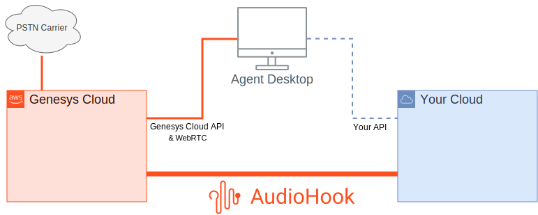
*High-level data flow: Genesys Cloud AudioHook integration with a third-party service and the agent desktop UI [2]*

AudioHook uses WebSockets over TLS as the transport. Text messages carry JSON metadata; binary messages carry audio. This makes framing trivial without incurring overhead such as Base64-encoding audio in JSON [2].

Based on the system configuration, Genesys Cloud establishes an AudioHook session at a designated point during a voice interaction. The session might be initiated when the interaction enters the system ("cradle to grave"), when it is transferred to a queue, or explicitly by means of a call flow action or API request [2].

### Conversations and Participants [2]

Genesys Cloud models `Conversation` resources as collections of `Participant` resources. AudioHook sessions monitor a **particular participant** and follow them through the conversation -- think of it as "taps" on the audio streams to and from that participant's party [2].

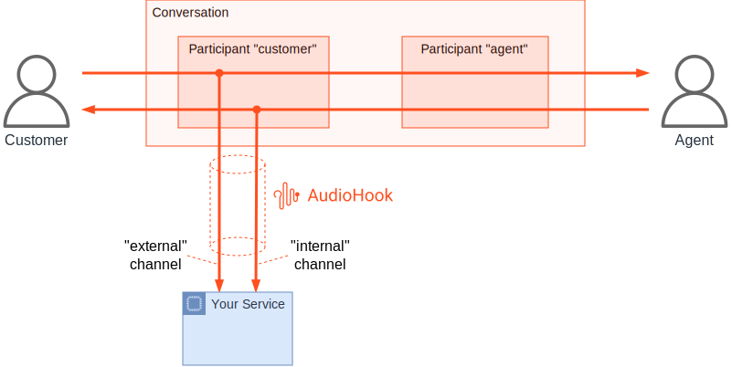
*AudioHook following the customer participant: "external" = what customer speaks, "internal" = what customer hears [2]*

**IVR and hold scenarios**: The AudioHook session seamlessly covers non-human participants. During IVR self-service, the "internal" channel reflects IVR audio. During queue hold, it reflects hold music. The "external" channel always reflects what the customer speaks, including anything uttered while "on hold" [2].

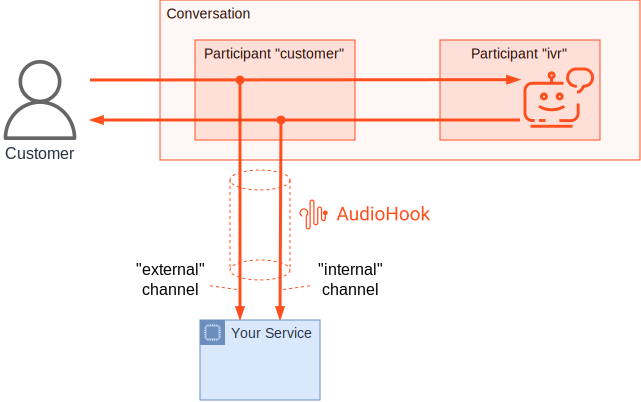
*AudioHook monitoring the customer participant during the self-service (IVR) part of a conversation [2]*

**Conference scenarios**: When an agent conferences a second agent, the "internal" channel for a customer-following AudioHook represents a **mix** of both agents' audio -- exactly what the customer hears. Services analyzing an individual agent's voice may not work properly from the customer's "internal" channel [2].

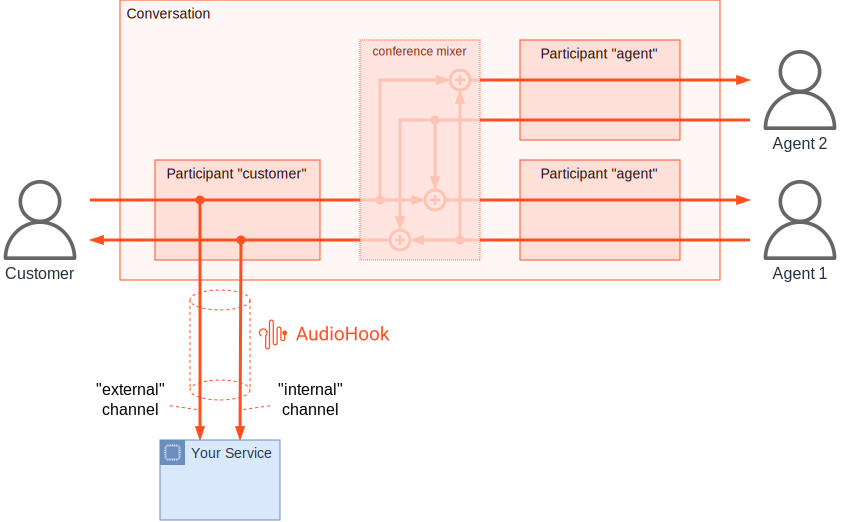
*AudioHook monitoring the customer participant in a conference between a customer and two agents [2]*

#### Current Limitation: Follow-the-Customer Only [2]

**In the current release, AudioHook only supports the "follow the customer" participant model** [2]. This limitation is not inherent to the protocol -- the protocol supports following any participant. The following diagrams illustrate future capabilities:

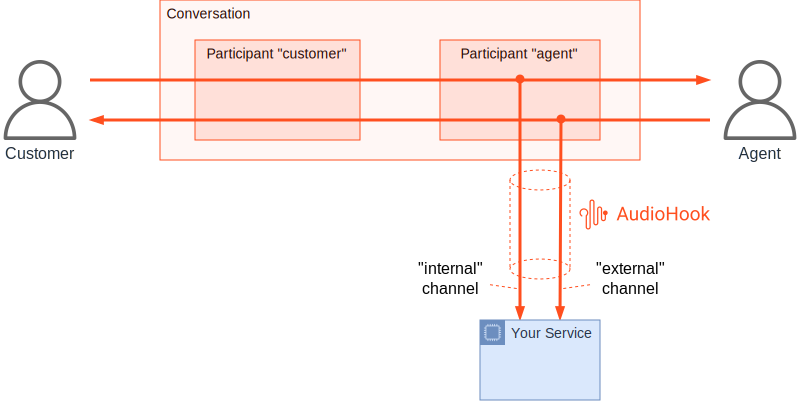
*AudioHook session following an agent participant: "internal" = what agent hears, "external" = what agent speaks [2]*

#### Independent Agent + Customer Analysis [2]

To independently analyze audio from both the customer and the agent, **two AudioHook sessions are necessary** -- one following each participant, each using only the "external" channel [2]:

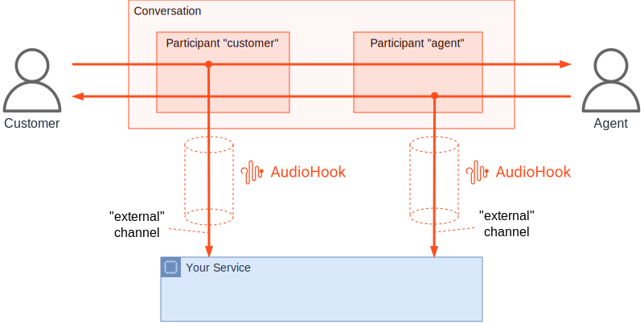
*Two separate AudioHook sessions each monitoring the "external" channel of their respective participant [2]*

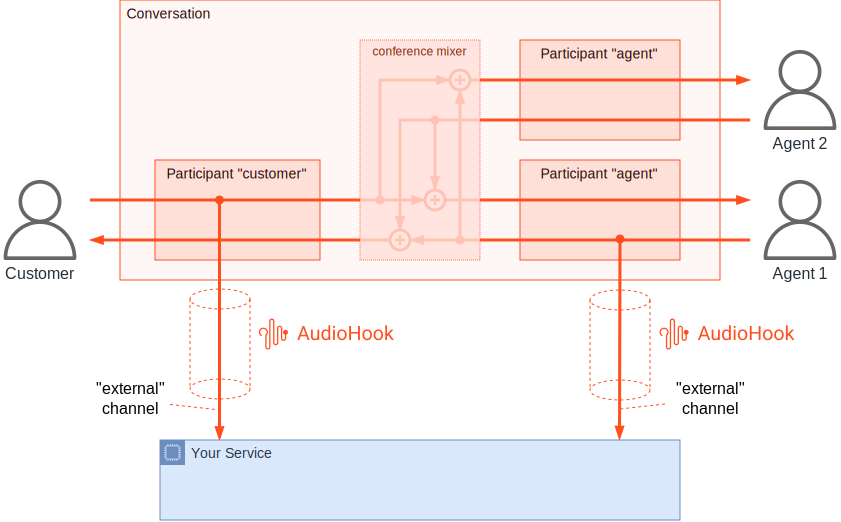
*Two AudioHook sessions in a conference scenario -- note the agent's "external" is only their voice, not the mix [2]*

**Implication for our use case**: We need both customer and agent audio, labeled and distinguishable. **Stereo mode delivers this with a single AudioHook session.** After splitting the interleaved stereo frames, channel 0 (`external`) = customer voice, channel 1 (`internal`) = agent voice. Each channel is sent to a separate Deepgram connection, so transcripts are always attributed to the correct speaker [2][3].

**Caveat**: The `internal` channel is technically "what the customer hears" -- in a standard 1:1 agent call this IS the agent's voice. During IVR self-service it contains IVR audio, during hold it contains hold music, and in a multi-agent conference it contains a **mix** of all agents [2]. For normal agent-customer calls (our primary use case), the internal channel provides clean, isolated agent audio. The "follow the customer" limitation only matters if you need a session that independently follows the *agent* participant -- not needed for our use case.

---

## 2. Architecture and Protocol

### WebSocket Protocol

- **Endpoint path**: `/api/v1/audiohook/ws` (configurable) [19]
- **Protocol**: WSS (WebSocket Secure) in production; WS permitted locally [7]
- **Max payload**: 65,536 bytes (64 KB) per WebSocket message [19]
- **Protocol version**: `"2"` [8][23]

### Audio Specifications

| Parameter | Value | Source |
|-----------|-------|--------|
| **Sample rate** | 8,000 Hz (only supported rate) | [3][9][10] |
| **Encoding formats** | PCMU/mu-law (all features); L16 only for Bot Transcription Connector | [3][9][24] |
| **Channels** | Mono (external or internal) or Stereo (external + internal interleaved) | [3][9][18][28] |
| **Channel labels** | `external` (customer), `internal` (agent) | [3][9][28] |
| **Transport** | Binary frames over WebSocket (headerless raw audio) | [3][26][27] |

**Important:** The Genesys client currently **only offers PCMU**, except for Bot Transcription Connector which also offers L16. Genesys reserves the right to offer different media formats in future releases [3].

The 8,000 Hz rate is enforced by the protocol validator -- no other rate is accepted [10]:
```typescript
// From validators.ts [10]
export const isMediaRate = (value: JsonValue): value is MediaRate => (value === 8000);
```

### Media Negotiation [3]

The client sends an array of media options in the `open` message. The server **must choose exactly one** and must not modify the offered format. This is similar to SIP/SDP offer-answer, just simpler [3].

Example media offer from client:
```json
"media": [
  {"type": "audio", "format": "PCMU", "channels": ["external", "internal"], "rate": 8000},
  {"type": "audio", "format": "PCMU", "channels": ["external"], "rate": 8000},
  {"type": "audio", "format": "PCMU", "channels": ["internal"], "rate": 8000}
]
```

The server responds with its selection in the `opened` message. Returning an empty `media` array does **not** reject the session -- it suppresses the audio stream. The session remains active for control messages but no audio is sent [3].

### Bandwidth Calculation

At 8,000 Hz with 16-bit PCM (the highest quality format) [9]:
- **Mono**: 8,000 samples/s x 2 bytes = 16,000 bytes/s = **128 kbps**
- **Stereo**: 8,000 samples/s x 2 bytes x 2 channels = 32,000 bytes/s = **256 kbps**

With PCMU (8-bit encoding) [9]:
- **Mono**: 8,000 bytes/s = **64 kbps**
- **Stereo**: 16,000 bytes/s = **128 kbps**

**Per 1,000 concurrent calls (stereo PCMU)**: ~128 Mbps inbound audio traffic.

### Protocol Message Types

**Client-to-Server (Genesys sends)** [8][24]:

| Type | Description |
|------|-------------|
| `open` | Initiates session with media parameters, language, organization ID |
| `ping` | Protocol-level keepalive with sequence number |
| `update` | Session parameter updates (e.g., language change) |
| `close` | Graceful session termination with reason |
| `error` | Client-side error notification |
| `paused` | Acknowledges a pause request |
| `resumed` | Acknowledges resume, reports discarded audio |
| `discarded` | Reports that audio was discarded |

**Server-to-Client (AudioHook server sends)** [8][24]:

| Type | Description |
|------|-------------|
| `opened` | Completes open transaction, confirms media negotiation |
| `pong` | Response to ping with sequence tracking |
| `updated` | Confirms update request |
| `closed` | Confirms session closure |
| `disconnect` | Server-initiated abnormal termination (e.g., auth failure) |
| `event` | Sends entities back to client (transcripts, agent assist) |
| `pause` | Requests client to pause audio streaming |
| `resume` | Requests client to resume audio streaming |
| `reconnect` | Requests client to reconnect |

### Session Lifecycle [3][25][37]

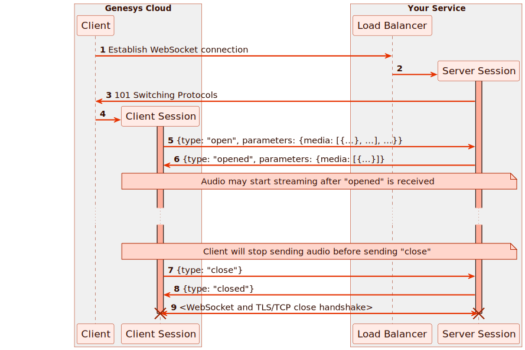
*High-level AudioHook session lifetime: Client (Genesys) → Load Balancer → Server Session [3]*

1. Genesys initiates HTTPS GET with `Upgrade: websocket` header + authentication headers [3][14]
2. Client sends `open` message with session info (organizationId, conversationId, participant ANI/DNIS), media offers, and language [3][8][25]
3. Server picks exactly one media format from the offer, creates backend resources, responds with `opened` [3][8][25]
4. Client sends **catch-up audio** from its history buffer (faster than real-time), then continues with real-time stream [3]
5. Audio streaming continues -- binary audio frames from Genesys, control messages both directions [3][26][27]
6. During secure flows or server request, audio may be paused/resumed [3][36]
7. Client may send `update` messages (e.g., language change mid-call) [3]
8. On call end, Genesys sends `close`; server finalizes analytics, sends final `event` messages, then responds with `closed` [3][8][25]
9. Client terminates TLS/TCP connection [3]

**Session rejection**: Server can reject a session by responding to `open` with a `disconnect` message instead of `opened`. Must not just close the TCP connection [3].

**Start paused**: Server can include `"startPaused": true` in the `opened` response to start the session in a paused state (no audio sent until resumed) [3].

### Retry Behavior [3]

Genesys performs **up to 5 connection retries** with exponential backoff on retryable failures [3]:

**Retryable failures** (will retry) [3]:
- Client-side failures
- Connection failures
- Connection/open timeouts
- Server `disconnect` messages with error reason

**Non-retryable failures** (will NOT retry) [3]:
- WebSocket upgrade failures
- Host unavailable
- Authentication failures
- Bad message failures
- Media handshake mismatch
- Conflict failures

Retries differ from reconnects: retries do not add a "Continued Session" entry and do not change the audio stream position [3].

### History Buffer and Catch-Up [3]

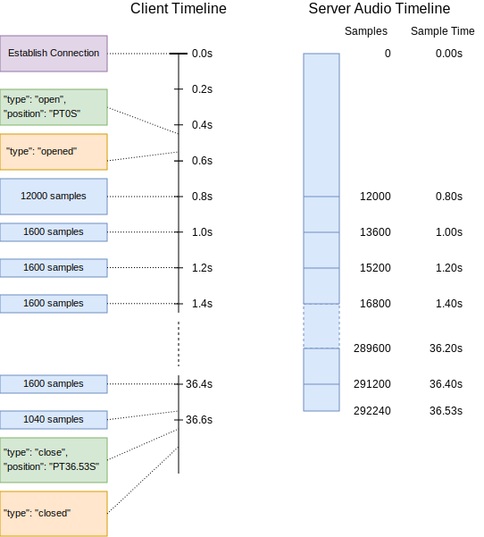
*Timeline of session establishment showing catch-up frames and real-time streaming [3]*

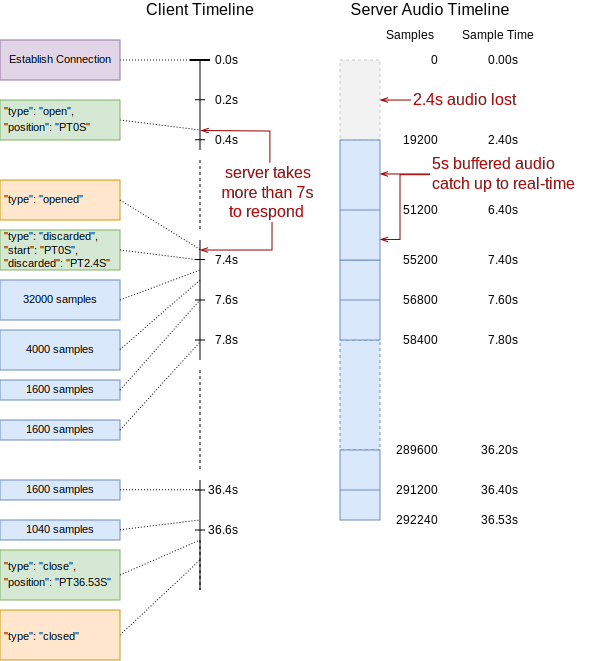
*Timeline showing audio loss when the server takes too long to respond (2.4s lost in this example) [3]*

- Client maintains a **30-second audio history buffer** (buffers up to 30s, offers last 20s) [3]
- Audio is buffered during WebSocket connection setup and the `open` transaction [3]
- After `opened` response, buffered audio is sent **faster than real-time** (catch-up), then real-time streaming continues [3]
- Catch-up rate is undefined -- may be a single large frame or several traffic-shaped smaller frames [3]
- If connection setup exceeds the buffer, a `discarded` message indicates lost audio before the first frame [3]
- **The `position` in the `open` message starts at `PT0S`** even if connection setup took time [3]
- History also stores client-side `paused`/`resumed`, `discarded`, and `update` messages -- all replayed in order on reconnect [3]

### Sequence Tracking [3][8][25]

- Both client and server maintain independent, monotonically increasing sequence numbers [8]
- Each message echoes the last received seq from the other side (`serverseq` / `clientseq`) [8][23]
- **Sequence mismatch causes disconnection** with error code 3000 [25]
- Position tracking uses ISO 8601 duration format (e.g., `PT6.3S`) calculated as `samples / sampleRate` [3][17]
- **Do not round positions** -- frame sizes are arbitrary; implementers must count samples exactly [3]

### Audio Frame Details [3][26][28]

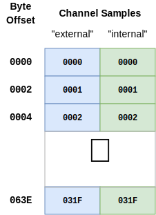
*Memory layout of a two-channel (stereo) PCMU audio frame with 800 samples (100ms @8000Hz) [3]*

- Binary WebSocket frames, headerless raw audio data [3][26]
- Stereo: interleaved samples `[external, internal, external, internal, ...]` [3][28]
- 100ms PCMU frame at 8kHz stereo = 800 samples x 2 channels x 1 byte = **1,600 bytes** [3][26]
- Frame sizes are variable and client-determined (trade-off: larger = higher latency, smaller = higher overhead) [3]
- The client guarantees frames contain only whole samples for all channels [3][26]

### Ping and Keepalive [3]

- Client sends `ping` messages at **regular intervals** (~5 seconds) while connection is open [3]
- Server must respond with `pong` as quickly as possible [3]
- Client measures application-level round-trip time; reports RTT in subsequent `ping` as `rtt` parameter [3]
- If server doesn't respond within one ping interval, client may treat as lost connection and reconnect [3]
- Pings are NOT sent during `open` or `close` transactions [3]
- Client sends 2 rapid pings ~1 second after `open` completes for initial RTT measurement [3]

### Pausing Audio [3]

Two independent pause sources that can be active simultaneously [3]:

1. **Server-initiated pause**: Server sends `pause` → client responds with `paused`. Server ends it with `resume` → client responds with `resumed` [3]
2. **Client-initiated pause**: Client sends unprompted `paused` (e.g., during PCI secure flow). Ends when client sends `resumed` [3]

Audio only resumes when **both** client and server have ended their pauses [3]. Client discards audio while paused and tracks the amount discarded. On resumption, `resumed` message includes discarded audio info for timeline re-sync [3].

### Update Transaction [3]

After the open transaction, the client may send `update` messages for properties that change mid-conversation. Currently **only `language` is updatable** [3]. The server should:
- Respond with `updated` to acknowledge [3]
- Or send `disconnect` to reject (must not just close TCP) [3]
- Or send `pause` if the new language is unsupported [3]
- Older servers that don't recognize `update` must silently ignore it [3]

### Close Transaction [3]

- Client stops sending audio and sends `close` message [3]
- Server uses the close window to finalize analytics and send final `event` messages [3]
- Server responds with `closed` when done; client then closes the TCP connection [3]
- If server doesn't respond in time, client sends 408 `error` and closes connection [3]
- **Server must NOT close TCP on its own** -- must send `disconnect` message first. Unsolicited TCP close is interpreted as network failure and triggers reconnection [3]

### Connection Probe [25]

Genesys sends a connection probe when the AudioHook integration is saved in admin [25]. Identified by null UUID conversation ID `00000000-0000-0000-0000-000000000000` [25]. The server should respond with `opened` with empty media and NOT log this as a real session [25].

### Re-establishing Sessions (Reconnection Protocol) [3]

**This is an experimental feature, not enabled by default.** Must be toggled on in the integration config. Currently only available for **AudioHook Monitor** and **Transcription Connector** [3].

Two reconnection triggers [3]:

#### Planned Handover (Server-Initiated) [3]

Server sends a `reconnect` message to trigger reconnection. Use cases:
- Service instance replacement during deployment [3]
- Scale-in of cluster [3]
- Migration on spot-fleet interruption notice [3]
- Rebalancing due to excessive load [3]
- AZ or region evacuation [3]
- Internal or downstream errors [3]

During planned handover, the **original session stays open** and continues receiving audio until the new session is established [3]. The original session loses control -- it can no longer `disconnect` the connection [3].

#### Unplanned Failure (Client-Initiated) [3]

Triggered by failures that terminate the original session. Reconnectable failures [3]:
- Client-side failures
- Connection failures
- Ping/close timeouts
- Server `disconnect` with error reason

Non-reconnectable failures (session terminates permanently) [3]:
- Bad message failures
- Rate limit failures
- Conflict failures
- Audio stream throttling

#### Reconnection Behavior [3]


*Four scenarios showing how client pauses interact with the 20-second offered history window during reconnection [3]*


*Two scenarios showing how discarded audio periods are included in the 20-second offered history [3]*

- Each reconnect adds a `continuedSession` entry in the new `open` message [3]
- Client offers up to **20 seconds of buffered audio** (from 30-second buffer); `position` in `open` is set to the start of the offered window [3]
- Server controls replay via `discardTo` parameter in `opened` -- tells client how much of the offered buffer to skip [3]
- If client honors `discardTo`, it acknowledges with a `discarded` message [3]
- `discardTo` is best-effort; server must not assume it will be honored [3]

#### Disconnect Reasons During Reconnection [3]

If the new session's server sends `disconnect`, the reason determines behavior:

| Reason | Client Behavior |
|--------|----------------|
| `completed` | Closes all sessions (reconnecting + original) [3] |
| `unauthorized` | Stops reconnection; keeps original session open if still alive [3] |
| `rejected` | Stops reconnection; switches back to original session [3] |
| `error` | Retries with exponential backoff; falls back to original if all attempts fail [3] |

#### Server Checkpoints (Recommended) [3]

For proper audio handover, servers should maintain regular checkpoints in external storage (Redis, DynamoDB, etc.) [3]. Recommended checkpoint data:
- Session ID (entry key) [3]
- Last known audio stream position [3]
- Server-paused state [3]
- `clientseq` and `serverseq` [3]
- Application-specific state [3]

**Create checkpoints on every `ping` message** (~5 second interval) [3]. Without checkpoints, the server must accept all 20 seconds of offered history audio [3].

#### Event Offsets on Reconnected Sessions [3]

Transcript event `offset` values reset to `PT0S` on each reconnected session. The client is responsible for adjusting server-provided offsets to the proper stream position [3].

---

## 3. Authentication and Security

### HTTP Signature-Based Authentication [11][12][13][14]

AudioHook uses HTTP Message Signatures (based on `draft-ietf-httpbis-message-signatures`) with HMAC-SHA256 for request authentication [11][12].

**Signed components** (required) [11][14]:
- `@request-target` -- URL path + query
- `@authority` -- host header
- `audiohook-organization-id`
- `audiohook-session-id`
- `audiohook-correlation-id`
- `x-api-key`

### Required Headers [3][14]

Every AudioHook WebSocket connection must include these headers [3][14]:

| Header | Format | Purpose |
|--------|--------|---------|
| `Audiohook-Organization-Id` | UUID | Genesys org identifier |
| `Audiohook-Session-Id` | UUID | Unique session identifier |
| `Audiohook-Correlation-Id` | UUID | Correlation tracking |
| `Audiohook-Retry-Attempt` | Integer (starts at 0) | Connection attempt counter; incremented per retry [3] |
| `X-API-KEY` | String (Base64) | API key for authentication |
| `Signature` | HTTP Signature | Request signature value (if client secret configured) |
| `Signature-Input` | HTTP Signature | Signature metadata |

### Security Constraints [12][13]

- **Maximum clock skew**: 3 seconds [12]
- **Maximum signature age**: 10 seconds (configurable) [12]
- **Nonce minimum length**: 22 characters (Base64-encoded random bytes) [11]
- **Timing attack mitigation**: Timing-safe comparison is used; signature failures incur a minimum **500ms delay** [12]
- **Unknown key handling**: Unknown API keys trigger verification with randomly generated dummy keys to prevent timing-based key enumeration [12][13]

### Authentication Strategies [13]

The reference implementation supports two strategies (controlled by `SESSION_AUTH_STRATEGY` environment variable) [13]:

1. **Request-based**: Signature verified during the HTTP upgrade request (before WebSocket is established) [13]
2. **Session-based**: Authentication deferred to after WebSocket connection, verified on the first protocol message [13]

### Credential Storage [7][13]

- **Production**: AWS Secrets Manager (`SECRET_NAME_OR_ARN` environment variable) [7][13]
- **Development**: Static API key map as JSON (`STATIC_API_KEY_MAP` environment variable) [7]
- Client secrets are Base64-encoded [7]

### Client Authentication Details (Official Spec) [5]

Genesys Cloud only connects to servers through TLS with certificates signed by a public CA [5]. The API key is passed as `X-API-KEY` header. Combined with `Audiohook-Organization-Id`, the server can identify the Genesys Cloud tenant and verify they are a legitimate subscriber [5].

If a client secret is configured, Genesys signs the request per [Signing HTTP Messages](https://datatracker.ietf.org/doc/html/draft-ietf-httpbis-message-signatures) [5].

**Signature parameters** [5]:

| Parameter | Description |
|-----------|-------------|
| `alg` | Signature algorithm. Currently only `hmac-sha256` [5] |
| `keyid` | API key value (same as `X-API-KEY` header). Simplifies config and discourages key reuse [5] |
| `created` | UNIX timestamp when client created the request. Each request gets a unique signature [5] |
| `expires` | Client-specified signature lifetime. Servers must reject expired signatures (with slop for clock skew) [5] |
| `nonce` | Random bytes (128+ bits), unique per request. Servers should reject signatures without a nonce [5] |

**Credential format requirements** [5]:

| Credential | Regex | Notes |
|-----------|-------|-------|
| API Key | `^[a-zA-Z0-9+/_-]+={0,2}$` | Simple tokens, UUIDs, or Base64 sequences. Client treats as opaque [5] |
| Client Secret | `^(?:[A-Za-z\d+/]{4})*(?:[A-Za-z\d+/]{3}=?\|[A-Za-z\d+/]{2}(?:==)?)?$` | Base64-encoded octets. Empty string disables request signing [5] |

**Security recommendations for server implementers** [5]:
- Verify signature before validating other header fields
- If `keyid` is unknown, verify with a dummy random key of same length (no short-circuiting)
- Always verify with `hmac-sha256` regardless of `alg` parameter (avoid algorithm switching)
- Decode signature to binary for comparison; do not compare Base64 strings (canonicalization attacks)
- Consider delaying all failure responses to a fixed delay to reduce timing side-channels
- Respond with HTTP 401 and no error-dependent details on all verification failures
- Servers that verify after WebSocket upgrade must signal auth failure with `disconnect` reason `unauthorized` (may be sent at any time during a session) [5]

### Throttling (Client-Side Flow Control) [5]

The client may limit outstanding audio queued for transmission. If transmission falls behind (TCP flow control, poor network, server overload), the client enters "throttled" state and discards subsequent audio [5]:

1. **Throttled state**: Client discards audio scheduled for transmission when send buffer backs up [5]
2. **Recovery**: When congestion clears, client sends a `discarded` message indicating the lost audio gap [5]
3. **Catch-up**: Audio immediately after the `discarded` message may arrive faster than real-time as the client catches up [5]
4. **Severe congestion**: If congestion is too severe, the client may end the session. It will attempt to send a `close` message, but if that can't be delivered, the close transaction times out from the moment the client *attempts* to send (not when in-flight). The client may then try to re-establish the session as best-effort [5]

The client never discards non-audio messages. The exact throttling threshold depends on the upstream provider and factors outside client control [5].

### Rate Limiting (Server → Client) [5]

The client limits the rate of messages accepted from the server using the **token bucket algorithm** [5]. Rate limit parameters are defined in the Genesys [Limits Documentation](https://developer.genesys.cloud/platform/api/rate-limits) [5].

**If the server exceeds rate limits** [5]:
- The client may aggressively terminate connections without 429 errors if traffic is deemed severely abusive
- The client may temporarily or permanently stop establishing new sessions to a misbehaving server

### Other Protocol Limits [5]

| Limit | Value | Description |
|-------|-------|-------------|
| **WebSocket Port** | 443 | Only port 443 is allowed [5] |
| **Maximum Message Size** | 64,000 bytes | Max for both text and binary messages [5] |
| **Maximum Custom Config Size** | 60,000 bytes | Max for the `customConfig` JSON payload [5] |
| **Open Timeout** | 5,000 ms | Server must respond to `open` within 5 seconds [5] |
| **Close Timeout** | 10,000 ms | Server must respond to `close` within 10 seconds [5] |
| **Ping Timeout** | 5,000 ms | Server must respond to `ping` within 5 seconds [5] |

### Sensitive Data Handling [5]

The Genesys AudioHook client does **not** log data in protocol messages that may contain sensitive information [5]. Specifically:
- Only aggregate statistics and protocol state information are tracked [5]
- Only `reason` codes, `error` codes, and informational messages in `disconnect` and `reconnect` messages are logged [5]
- Audio data is never persisted or logged by Genesys -- only buffered briefly in process memory [5]
- Messages that fail to parse are not logged (to avoid leaking sensitive data from malformed messages) [5]

**Server responsibility**: Servers must ensure no sensitive information is included in error and diagnostic messages [5].

---

## 4. TLS and Certificate Requirements

**This is the single most important production requirement** [7]:

> "Self-signed certificates are not supported" [7]

### Requirements

| Requirement | Detail | Source |
|-------------|--------|--------|
| **Certificate authority** | Must be a publicly trusted CA (e.g., Let's Encrypt, DigiCert, ACM) | [7] |
| **Self-signed certificates** | **Not supported** -- connections will fail | [7] |
| **Protocol** | WSS (WebSocket Secure) required in production | [7] |

### Reference Implementation TLS Stack [7]

- AWS Certificate Manager (ACM) issues the TLS certificate [7]
- Route 53 hosted zone provides DNS [7]
- Application Load Balancer (ALB) terminates TLS [7]
- Fargate container receives unencrypted traffic from ALB on port 8080 [7][20]

---

## 5. Deployment Architecture

### Reference Implementation Infrastructure [7]

```
Internet
  |
  v
Route 53 DNS ──> Application Load Balancer (ALB)
                     |  (TLS termination via ACM cert)
                     v
                 ECS Fargate Task(s)
                     |  (port 8080, Node.js)
                     |
                     ├──> S3 Bucket (recording storage)
                     ├──> DynamoDB (session tracking)
                     ├──> Secrets Manager (API credentials)
                     └──> CloudWatch (logging)
```

### Container Configuration [19][20]

| Setting | Value | Source |
|---------|-------|--------|
| **Base image** | `node:16-slim` | [20] |
| **Internal port** | 8080 | [19][20] |
| **Bind address** | `0.0.0.0` (all interfaces) | [19] |
| **User** | `node` (non-root) | [20] |

### Server Routes [19]

| Path | Purpose | Source |
|------|---------|--------|
| `/api/v1/audiohook/ws` | Standard AudioHook endpoint | [19] |
| `/api/v1/voicetranscription/ws` | Voice transcription endpoint | [19] |
| `/api/v1/loadtest/ws` | Load testing endpoint | [19] |
| `/health/check` | ALB health check | [19] |

### Azure Python Reference Architecture [21][22]

The Azure-Samples implementation provides a Python alternative [21]:
- **Framework**: Quart (async Flask) with Gunicorn + Uvicorn workers [32][33]
- **STT provider**: Pluggable via `SpeechProvider` interface [31] -- ships with Azure AI Speech [30] and Azure OpenAI GPT-4o [21]
- **Storage**: CosmosDB for conversation tracking, Azure Blob Storage for recordings [21]
- **Events**: Azure Event Hub for downstream event publishing [21]
- **Timeout**: 230 seconds (aligned with Azure App Service defaults) [33]
- **Workers**: `(CPU count * 2) + 1` Uvicorn workers [33]

---

## 6. Scaling Considerations

### Reference Implementation Limitations [7]

The README explicitly states [7]:

> "The code in this repository is provided as a sample blueprint to get started building an AudioHook server and test protocol compliance. It does not include some of the robustness and resiliency patterns that you will likely require for a production quality service."

Missing from the reference implementation [7]:
- Rate limiting or circuit breakers
- Horizontal scaling configuration
- Auto-scaling policies
- Connection pooling
- Backpressure handling
- Retry logic for S3 uploads

### Connection Limits (Genesys Side)

**Max 5 AudioHook Monitor integrations per organization** (hard limit) [37][41]. No documented limit on concurrent streaming sessions within those integrations [37].

Practical limits [37]:

1. **Per-call overhead**: Each call creates one WebSocket connection. At 1,200 concurrent agents, up to 1,200 simultaneous WebSocket connections [3]
2. **Genesys media tier capacity**: AudioHook streams originate from Genesys's media tier (same infrastructure handling RTP audio) [37]
3. **AppFoundry licensing**: AudioHook Monitor is a premium AppFoundry application with per-minute billing [37][38]

### Server-Side Scaling Strategy

For 1,200 concurrent agents (~500-1,000 concurrent calls):

**Compute:**
```
Per-call resources (stereo PCMU) [9]:
  Audio ingestion:  ~16 KB/s inbound
  WebSocket:        ~1 connection, minimal CPU for protocol handling

For 1,000 concurrent calls:
  Bandwidth:        ~128 Mbps inbound (audio only, PCMU stereo)
  WebSocket conns:  ~1,000 concurrent
```

**Gloo Gateway considerations:**
- Gloo Gateway natively supports WebSocket connections
- Idle timeout must exceed the longest expected call duration (**must be increased** from default to at least 3600s)
- Connection draining timeout must allow active calls to complete during deployments

### Session Recording and Storage [7]

**Storage estimate (stereo PCMU, 6-min average call) [9]:**
- PCMU: 8,000 Hz x 1 byte x 2 channels x 360s = ~5.76 MB per call
- At 40,000 calls/day: ~230 GB/day of raw audio (PCMU) or ~460 GB/day (L16)

---

## 7. AudioHook Monitor Configuration in Genesys

### Hard Limits [37][41]

- **Maximum 5 AudioHook Monitor integrations per organization** (non-configurable) [37][41]
- No documented limit on concurrent streaming sessions within those 5 integrations [37]
- Additional integrations can be requested through Genesys support [41]

#### What "5 Integrations" Means for Our Use Case

Each integration = one WSS endpoint URL (one AudioHook server). The limit is on **distinct endpoints**, not on concurrent calls or sessions. A single integration can handle unlimited concurrent streaming sessions [37].

**Our use case requires 3 integrations** (production + QA + dev):

| Environment | Endpoint URL | Integrations |
|-------------|-------------|:------------:|
| **Production** | `wss://audiohook.yourcompany.com/api/v1/audiohook/ws` | 1 |
| **QA** | `wss://audiohook-qa.yourcompany.com/api/v1/audiohook/ws` | 1 |
| **Dev** | `wss://audiohook-dev.yourcompany.com/api/v1/audiohook/ws` | 1 |
| **Total** | | **3 of 5** |

- Each environment is a separate Genesys org (or separate integration config within the same org), each pointing to a different WSS endpoint URL
- All 1,200 agents / 1,000+ concurrent calls / 40,000 calls per day flow through the **production** integration
- QA and dev environments have lower traffic volumes
- **Horizontal scaling (e.g., 6 Kubernetes pods) does NOT consume additional integrations** -- all pods serve traffic behind the same Gloo Gateway URL. Genesys has no awareness of how many pods exist behind the endpoint
- **2 integrations remain available** for future needs (e.g., adding a voice biometrics vendor)

**Scenarios showing integration budget:**

| Scenario | Integrations Used | Remaining |
|----------|:-----------------:|:---------:|
| STT only (prod + QA + dev) | **3** | 2 |
| Above + voice biometrics vendor | **4** | 1 |
| Above + separate recording vendor | **5** | 0 |
| Above + additional provider | **Exceeds 5** — must request increase from Genesys support | - |

**Architectural implication:** Each environment's AudioHook server handles all fan-out internally behind a single URL. One inbound WebSocket from Genesys → server fans out to Deepgram (STT), LLM (analysis), SQS (async capture to S3 + DynamoDB). This is the architecture described in Section 13.

**Cost implication:** Genesys bills per-minute **per integration** [38]. QA and dev environments will incur per-minute charges during testing, but at much lower volumes than production. Since each environment uses 1 integration, we pay the per-minute rate once per call per environment.

### Billing Model [38]

- **Per-minute charging**: Genesys charges per minute that AudioHook Monitor runs [38]
- **Per-integration**: Each active integration is billed separately [38]
- **Session-based**: Billing starts when streaming begins and stops when streaming ends [38]
- **No charges during pauses**: Paused streams (secure flows, server-initiated pauses) are not billed [38]
- Usage is tracked and rounded to the nearest minute at month end [38]
- Volume tiers are available (details require AppFoundry login) [38]

### Installation [35][47]

**Method 1: From Genesys AppFoundry** [47]
1. Navigate to the Genesys AppFoundry website
2. Sign in to your Genesys Cloud organization
3. Search for "AudioHook Monitor"
4. Click the app card to view details
5. Click **Purchase**

**Method 2: From Genesys Cloud Integrations Page** [47]
1. Log into Genesys Cloud
2. Navigate to Admin > Integrations > Integrations (or Menu > IT and Integrations > Integrations)
3. Click to add a new integration
4. Search for "AudioHook"
5. Click the AudioHook card
6. Click **Install**

Installation adds the app to the Integrations page. You must add a separate AudioHook Monitor instance for each endpoint [35][47].

### Step-by-Step Configuration [35]

**Prerequisites:**
- AudioHook Monitor installed from AppFoundry [35]
- An AudioHook Monitor instance added for each endpoint [35]

**1. Open the Configuration** [35]
1. Click Menu > IT and Integrations > Integrations
2. Select AudioHook Monitor
3. *(Recommended)* In the Details tab, enter a unique name (e.g., "AudioHook – Deepgram STT")
4. Click the Configuration tab

**2. Set Properties** [35]
1. Click the **Properties** tab
2. **Channel**: Select `both` (stereo: external/customer on left channel, internal/agent on right channel). Unless you have an explicit reason to select internal or external only, best practice is `both` [35]
3. **Connection URI**: Enter your WebSocket endpoint. **Must begin with `wss://`** (not `https://`) [35]. Example: `wss://audiohook.example.com/api/v1/audiohook/ws`
4. **Reconnections**: Select whether Genesys Cloud should attempt to reconnect on connection failures [35]. Off by default. If enabled, your AudioHook server must also implement reconnection support per the protocol spec [35]

**3. Advanced Configuration (Optional)** [35]
1. Click the **Advanced** tab
2. Enter any additional JSON values to send to the AudioHook server [35]
3. This JSON is sent unaltered as the `customConfig` property in the `open` command [35]

Example `customConfig` for Deepgram integration:
```json
{
  "sttProvider": "deepgram",
  "model": "nova-3",
  "language": "en-US",
  "enableInterimResults": true,
  "captureAudio": true
}
```

**4. Set Credentials** [35]
1. Click the **Credentials** tab
2. Click **Configure**
3. Enter:
   - **API Key**: The API key passed to servers in the `X-API-KEY` header [35]
   - **Client Secret**: Used to sign connection requests (HMAC-SHA256) and allow servers to authenticate the client [35]. Obtain from your service provider (i.e., generated by your AudioHook server deployment)
4. Click **OK**
5. Click **Save**

**5. Activate** [35]
1. Select the **Details** tab
2. Click **Inactive** to toggle status
3. Confirm activation by clicking **Yes**
4. The system runs a **connectivity probe** -- a test WebSocket connection with null UUID (`00000000-0000-0000-0000-000000000000`) [35]
5. If the probe succeeds, status changes to **Active**
6. If the probe fails, an error message appears with details [35]

**6. Validate After Changes** [35]
When you modify the Configuration tab on an active integration:
1. Set the Status switch to **Inactive** → click Yes
2. Set the Status switch to **Active** → click Yes
3. If configuration is correct, status returns to Active [35]

### Error Messages During Activation [35]

Error messages track occurrence frequency and combine with AND. Example:
```
WebSocket connection failed. (AND) 1399x Received a malformed server message. (AND) Close transaction timed out.
```
- `WebSocket connection failed` -- Initial WebSocket handshake failed [35]
- `1399x Received a malformed server message` -- Server sent a malformed message 1,399 times [35]
- `Close transaction timed out` -- Genesys could not close the connection per the AudioHook protocol [35]

### Two Activation Methods for Calls [36][37]

**Method 1: Queue-based monitoring** [36]
- Enable audio monitoring for specific queues
- All calls routed through those queues automatically stream audio

**Method 2: Architect flow integration** [36]
- Add the "Audio Monitoring" action within Architect call flows
- Provides granular control over which calls get streaming
- Can be conditional (e.g., by skill, customer segment, or call type)
- Can start/stop streaming mid-call [37]

### Media Language Configuration [40]

AudioHook Monitor is language-aware. The media language flows through these stages [40]:
1. **Trunk** → 2. **IVR Flow** (Set Language action overrides) → 3. **Queue** (overrides if defined) → 4. **In-Queue Flow** (final override)

The resolved language is included in the `open` message sent to the AudioHook server, which can use it to configure the STT engine's language model [40].

### PCI DSS Compliance [36][37]

- AudioHook Monitor adheres to PCI DSS when secure pause runs during secure flows [36]
- **Audio cannot be streamed during secure flows** -- Genesys sends a `pause` message and stops audio transmission [36]
- Best practice: avoid AudioHook Monitor for PCI-relevant interactions [36]

### Supported Deployments [37]

- Standard Genesys Cloud: **Supported** [37]
- BYOC Premises: **Not supported** [37]
- Premises-based Edge (LDM): **Not supported** [37]
- Server should be deployed in same or nearby AWS region as Genesys Cloud media tier [37]

---

## 8. Event Entities (Server → Client)

The server can send event messages containing transcript and agent assist entities back to Genesys [15][16].

### Transcript Entities [15]

Transcript entities allow the AudioHook server to send STT results back to Genesys for display in the agent UI [15]:

- `channelId`: `0` = external (customer), `1` = internal (agent) [15]
- `isFinal`: Whether this is a final or interim transcript [15]
- `alternatives` with `confidence`, `languages`, and `interpretations` containing `tokens` with word-level timing [15]

### Agent Assist Entities (Experimental) [16]

Agent assist entities allow sending suggestions back to the agent [16]:

- **Utterances**: Transcribed speech with position, confidence, channel, and language [16]
- **FAQ suggestions**: Question + HTML answer with confidence score [16]
- **Article suggestions**: Title + excerpts + document URI with confidence score [16]

---

## 9. AudioHook vs. EventBridge vs. Notifications API Comparison

This section places AudioHook in context with the two transcription delivery paths already evaluated in this project [47].

| Dimension | AudioHook | EventBridge (SQS) | Notifications API (WebSocket) |
|-----------|-----------|-------------------|-------------------------------|
| **What is delivered** | Raw audio (8kHz PCM/PCMU) [3] | Transcription text (JSON events) [47] | Transcription text (JSON events) [47] |
| **STT engine** | Your choice (Deepgram, etc.) [3] | Genesys r2d2 (built-in) [47] | Genesys r2d2 (built-in) [47] |
| **Transcription quality** | Engine-dependent (Deepgram Nova-3: 98.3% median confidence) [47] | Genesys r2d2: 78% median confidence [47] | Genesys r2d2: 78% median confidence [47] |
| **Expected latency** | ~1,140ms median (est. via Deepgram Direct POC [48]; actual Genesys AudioHook latency unvalidated) | ~1,570ms median (measured) [47] | ~1,369ms median (measured) [47] |
| **Per-conversation subscription** | No (configured per queue or Architect flow) [35][37] | No (single EB rule, org-wide) [47] | Yes (dynamic topic subscribe/unsubscribe per call) [47] |
| **Genesys API calls (steady state)** | 0 [35] | 0 [47] | ~88,640/day at 1,200 agents [47] |
| **Connection model** | 1 WebSocket per active call [3] | 0 WebSocket (SQS polling) [47] | 3-4 WebSocket channels [47] |
| **Bandwidth per call** | 64-256 kbps (audio) [9] | ~1-5 kbps (text events) [47] | ~1-5 kbps (text events) [47] |
| **Infrastructure required** | Kubernetes pods + Gloo Gateway + S3 + Secrets Manager [7] | 1 EB rule + 1 SQS queue + 1 consumer [47] | OAuth + channel management + WebSocket management [47] |
| **Application code complexity** | ~500-1,000 lines (AudioHook server + STT integration) [6][21] | ~80 lines (stateless SQS consumer) [47] | ~1,500+ lines (production estimate) [47] |
| **Failure recovery** | No reconnection for dropped calls [6] | SQS retains messages 4-14 days [47] | Must resubscribe all topics [47] |
| **Licensing** | Premium AppFoundry (per-minute billing) [38] | Included with EventBridge integration [47] | Included with Genesys Cloud [47] |

### When to Choose AudioHook

1. **You need a different STT engine** -- If Genesys r2d2's 78% median confidence is insufficient [47] and you need Deepgram (98.3% median confidence) [47] or another engine [3]
2. **You need real-time audio analysis beyond transcription** -- Voice biometrics, emotion detection, keyword spotting [36]
3. **You need the fastest possible transcription** -- AudioHook eliminates Genesys's r2d2 STT + endpointing latency and replaces it with your own engine's latency [47]
4. **You need waveform-level access** -- Recording, quality monitoring, or any use case requiring raw audio [3]

### When NOT to Choose AudioHook

1. **You only need transcription text** -- EventBridge delivers text at ~80 lines of code [47]
2. **Bandwidth is constrained** -- AudioHook requires 50-100x more bandwidth than text delivery [9]
3. **Genesys r2d2 quality is acceptable** -- No reason to add infrastructure complexity [47]
4. **Minimizing infrastructure is a priority** -- EventBridge requires 1 SQS queue; AudioHook requires a custom server deployment (Kubernetes pods, Gloo Gateway, S3, Secrets Manager) [7][47]

### Deepgram Direct POC: Measurement Methodology and Limitations [48][49]

The "Deepgram Nova-3" row in the [cross-system percentile analysis](ah_gn_eb_p95_p99_summary.md) [49] was labeled as an AudioHook latency proxy. This data came from a **Deepgram Direct POC** [48] -- a browser-based setup that streamed microphone audio locally to Deepgram, bypassing Genesys entirely. It measures Deepgram STT performance, not Genesys AudioHook performance.

**The two audio paths compared:**

```
Deepgram Direct path (measured) [48]:
┌──────────┐  16kHz   ┌────────────┐  256ms buf  ┌──────────────┐  local WS  ┌──────────────┐   WAN WSS   ┌──────────┐
│ Browser  │────PCM──>│ AudioCtx   │───────────>│ ScriptProc   │──────────>│ Local Server │───────────>│ Deepgram │
│ mic      │          │ 16kHz mono │            │ 4096 samples │          │ FastAPI      │           │ Nova-3   │
└──────────┘          └────────────┘            └──────────────┘          └──────────────┘           └──────────┘
     A                                               B                        C                         D
  ~0ms                                            256ms                     ~1ms                    ~150-300ms

Genesys AudioHook path (estimated based on official docs) [3]:
┌──────────┐  RTP    ┌──────────────┐  PCMU     ┌──────────────┐  WAN WSS  ┌──────────────┐   WAN WSS   ┌──────────┐
│ Phone /  │───────>│ Genesys      │  ~100ms   │ Frame buffer │────────>│ AudioHook    │───────────>│ Deepgram │
│ Telephony│        │ media tier   │  frames   │ + encode     │         │ Server       │  decode    │ Nova-3   │
└──────────┘        └──────────────┘           └──────────────┘         │ split stereo │           └──────────┘
     A                    B                         C                   └──────────────┘               D
  ~0ms              ~50-100ms                  ~100-200ms              E: ~10-60ms  F: <1ms       ~150-300ms
```

**Stage-by-stage comparison:**

| Stage | Deepgram Direct (measured) | Genesys AudioHook (estimated based on official docs) | Delta |
|-------|:--------------------------:|:-----------------------------:|:-----:|
| A. Audio source | Browser mic, ~0ms | Telephony RTP, ~0ms | — |
| B. Platform processing | AudioContext, ~0ms | Genesys media tier, ~50-100ms | +50-100ms |
| C. Frame buffering | ScriptProcessor 256ms | PCMU frame ~100-200ms | -56 to -156ms |
| D. Transport to server | Localhost WS, ~1ms | WAN WSS (same region), ~5-30ms | +4-29ms |
| E. Server processing | None (passthrough) | PCMU decode + stereo split, <1ms | +1ms |
| F. Transport to Deepgram | WAN WSS, same in both | WAN WSS, same in both | ~0ms |
| G. Deepgram STT inference | ~150-300ms | ~150-300ms (identical engine) | ~0ms |
| **Total non-Deepgram overhead** | **~257ms** | **~165-330ms** | **-90ms to +75ms** |

**Deepgram Direct POC architecture** [48]:
```
Browser mic → AudioContext 16kHz → 256ms ScriptProcessor buffer → local WebSocket
→ local FastAPI server → Deepgram Nova-3 streaming WebSocket → transcript events
```

**Deepgram Direct POC latency formula** [48]:
```
latency = server_receipt_time - (stream_start_time + audio_end)
```
Where `server_receipt_time` and `stream_start_time` are both `time.time()` on the same machine, and `audio_end` is the last word's end time from Deepgram (relative to stream start).

**What the Deepgram Direct POC measured accurately:**
- Deepgram Nova-3 STT inference latency (~150ms first word, ~300ms final transcript)
- Transcript confidence (98.3% median vs Genesys r2d2's 78%)
- Tail behavior: 0% of utterances >5s vs 3.2% for Genesys EventBridge

**What the Deepgram Direct POC did NOT measure (Genesys AudioHook adds these):**
- Genesys media tier capture and PCMU encoding latency (~100-200ms)
- WAN network transit: Genesys → AudioHook server (~5-30ms same-region)
- WAN network transit: AudioHook server → Deepgram (~5-30ms)
- Audio format conversion: 8kHz PCMU → PCM for Deepgram (<1ms)

**What the Deepgram Direct POC includes that Genesys AudioHook removes:**
- Browser ScriptProcessor buffer: 256ms fixed latency (Genesys AudioHook uses ~100ms frames)
- Browser → local server WebSocket: ~1-5ms (Genesys AudioHook has no browser in the path)

**Net assessment**: The Genesys-side latency added by AudioHook (~110-260ms) and the POC browser buffer removed (~256ms) roughly cancel. The Deepgram Direct POC is a **reasonable but imprecise proxy** for Genesys AudioHook latency. Actual Genesys AudioHook latency will not be known until an end-to-end POC with real Genesys call audio is built. Deepgram STT inference time is the largest fixed component and is identical in both paths.

**POC source**: Full implementation, session results format, and Deepgram vs Genesys comparison charts at `poc-deepgram/README.md` [48]. Comparison notebook: `poc-deepgram/notebooks/deepgram_vs_genesys.ipynb` [48].

---

## 10. Known Limitations

1. **Self-signed certificates not supported** -- Must use a publicly trusted CA [7]
2. **No audio during secure flows** -- PCI DSS compliance; Genesys sends `pause` [36]. Client and server pauses are independent and both must end before audio resumes [3]
3. **8,000 Hz sample rate only** -- Narrowband telephony quality [9][10]
4. **PCMU only for AudioHook Monitor** -- L16 is only offered for Bot Transcription Connector [3]
5. **Maximum 5 AudioHook Monitor integrations per organization** [37][41] -- no documented limit on concurrent sessions within those integrations
6. **Reconnection is experimental and off by default** -- Must be explicitly enabled in Genesys config AND implemented by the AudioHook server. Only available for AudioHook Monitor and Transcription Connector [3][35]
7. **Up to 5 connection retries** with exponential backoff on retryable failures. Non-retryable failures (auth, bad message, media mismatch) terminate immediately [3]
8. **Single WebSocket per session** -- No multiplexing; 1,000 calls = 1,000 connections [3]
9. **Reference implementation is not production-ready** -- Explicitly stated in README [7]
10. **Premium AppFoundry licensing required** -- per-minute billing, volume tiers available [38][43]
11. **BYOC Premises and premises-based Edge (LDM) not supported** [37]
12. **Per-minute billing** -- Genesys charges per minute per integration while streaming is active [38]
13. **Server must never close TCP unilaterally** -- Must send `disconnect` message first. Unsolicited TCP close is interpreted as network failure and triggers reconnection attempts [3]
14. **Transcript event offsets reset on reconnect** -- `offset` restarts at `PT0S` on each reconnected session; client adjusts to stream position [3]
15. **Port 443 only** -- WebSocket connections are restricted to port 443 [5]
16. **5-second open timeout** -- Server must respond to `open` within 5,000ms or connection is terminated [5]
17. **Token bucket rate limiting on server messages** -- Client rate-limits messages from server; severely abusive patterns may cause permanent session blacklisting [5]
18. **Follow-the-customer only** -- Current release only supports AudioHook sessions that follow the customer participant, not the agent [2]. Independent agent audio analysis requires this limitation to be lifted
19. **Client-side throttling discards audio** -- If TCP send buffer backs up (poor network or server overload), client enters "throttled" state and discards audio until congestion clears. Severe congestion may terminate the session [5]

---

## 11. Production Deployment Checklist

### Pre-Deployment

- [ ] Confirm AudioHook Monitor licensing with Genesys (premium AppFoundry, per-minute billing) [38][43]
- [ ] Confirm concurrent session limits with Genesys support (max 5 integrations, sessions unlimited?) [37]
- [ ] Obtain TLS certificate from public CA (ACM recommended) [7]
- [ ] Set up DNS (Route 53 hosted zone) [7]
- [ ] Select STT engine and validate it handles 8,000 Hz mono/stereo PCMU/PCM [9][10]
- [ ] Confirm Genesys Cloud media tier region and deploy AudioHook server in same region [37]
- [ ] Configure Gloo Gateway idle timeout to exceed maximum call duration (3600s+)

### Infrastructure

- [ ] Kubernetes namespace and deployment manifests for AudioHook server
- [ ] Gloo Gateway VirtualService with TLS and WebSocket support
- [ ] S3 bucket for recording storage (if recording) [7]
- [ ] AWS Secrets Manager for API key/secret storage [7][13]
- [ ] CloudWatch log group and alarms [7]

### Configuration

- [ ] API key and client secret generated and stored in Secrets Manager [7][13]
- [ ] AudioHook Monitor installed from AppFoundry [39]
- [ ] Integration configured in Genesys Cloud Admin with WSS endpoint URL [35]
- [ ] Activation via queue-based monitoring OR Architect flow [35][37]
- [ ] Health check path configured in Gloo Gateway upstream [19]

### Testing

- [ ] Single-call end-to-end test [18]
- [ ] Connection probe test (null UUID handling) [18][25]
- [ ] Secure flow test (verify pause/resume behavior) [36]
- [ ] Multi-call concurrent test (10, 50, 100 calls) [18]
- [ ] Load test at target concurrency (500-1,000 calls) [19]
- [ ] Authentication failure test (invalid API key, expired signature) [12][13][18]
- [ ] Network interruption test (WebSocket drops mid-call) [6]

---

## 12. Open Questions Requiring Genesys Support

1. ~~**What is the maximum number of concurrent AudioHook sessions per organization?**~~ **ANSWERED**: Max 5 integrations per org (hard limit) [37][41]. No documented limit on concurrent streaming sessions within those integrations [37]. Request more through Genesys support [41].

2. **Does AudioHook Monitor support wideband audio (16 kHz)?** All sources show 8,000 Hz only [9][10]. **Likely NO** -- protocol validator enforces 8,000 Hz.

3. ~~**What happens when the AudioHook server is unreachable?**~~ **ANSWERED**: Genesys performs up to 5 connection retries with exponential backoff for retryable failures (connection failures, timeouts, server disconnect with error). Non-retryable failures (auth, bad message, media mismatch, host unavailable) terminate immediately [3]. With reconnection enabled, additional reconnection attempts are made for mid-session failures [3].

4. ~~**What happens when a WebSocket connection drops mid-call?**~~ **ANSWERED**: With reconnection disabled (default), the session is lost. With reconnection enabled [3][35]: (a) Client attempts to reconnect with exponential backoff. (b) New `open` message includes `continuedSession` entry. (c) Client offers up to 20 seconds of buffered audio. (d) Server controls replay via `discardTo` parameter. (e) Non-reconnectable failures (bad message, rate limit, conflict, throttling) still terminate permanently [3].

5. ~~**Are there Genesys-side rate limits on new AudioHook connections per second?**~~ **ANSWERED**: The client uses a **token bucket algorithm** to rate-limit messages from the server [5]. Exact rate values are in the Genesys Limits Documentation [5]. The client may aggressively terminate connections without 429 errors if traffic is deemed severely abusive, and may temporarily or permanently stop establishing new sessions to a misbehaving server [5]. For **throttling**: the client limits outstanding audio queued for transmission and enters a "throttled" state if the send buffer backs up, discarding audio until congestion clears [5]. See Section 3 for full details.

6. **Which Genesys Cloud media tier regions support AudioHook?** Not explicitly documented. Genesys recommends deploying servers "in the same or near region to keep latency to a minimum" [37].

7. ~~**What are the licensing costs for AudioHook Monitor at 1,200 agents?**~~ **PARTIALLY ANSWERED**: Per-minute billing while streaming is active, per integration. Volume tiers available. Exact rates require AppFoundry login [38]. Contact Genesys sales for 1,200-agent pricing.

8. **NEW: What is the actual per-minute rate for AudioHook Monitor?** Pricing requires AppFoundry credentials to view [38]. Must be obtained from Genesys sales.

---

## 13. Direct Implementation: AudioHook → Deepgram → LLM (No Intermediary)

### Why Two Deepgram Connections Per Call

Genesys AudioHook sends stereo audio in a single WebSocket connection -- channel 0 (external/customer) and channel 1 (internal/agent) interleaved in each binary frame [3][9].

Deepgram's streaming API accepts a single mono audio stream per WebSocket connection. It does not natively demux interleaved stereo.

So the AudioHook server must:

1. Receive one stereo frame from Genesys
2. Split (deinterleave) it into two mono streams [28]
3. Open two separate Deepgram WebSocket connections -- one for the customer channel, one for the agent channel
4. Forward each mono stream to its respective connection

This is how you get labeled, per-speaker transcripts -- each Deepgram connection only ever hears one speaker, so you know which transcript belongs to whom without needing diarization.

At 1,000 concurrent calls, that means 1,000 inbound WebSocket connections from Genesys and 2,000 outbound WebSocket connections to Deepgram.

The alternative would be sending stereo to a single Deepgram connection, but Deepgram's streaming endpoint expects mono input. You would either lose a channel or get garbled interleaved audio.

### Design Principles

1. **No intermediary services between AudioHook server and Deepgram** -- the AudioHook server opens a direct streaming WebSocket to Deepgram's API
2. **No intermediary between Deepgram results and LLM** -- transcription text is forwarded directly to the LLM endpoint
3. **Existing infrastructure hosts the AudioHook server** -- Deepgram and the LLM are external API calls, not self-hosted services
4. **Async side-channel** for audio + text capture to DB (does not block the real-time path)

### Architecture

```
Genesys Cloud                          Kubernetes Cluster                    External APIs
─────────────                          ──────────────────                    ─────────────
                                       ┌─────────────────────────────────┐
  Call Audio ──WSS──────────────────>   │  AudioHook Server (pods)       │
  (8kHz PCMU stereo)                   │                                 │
                                       │  1. Receive binary audio frames │
                                       │  2. Split stereo → 2 mono      │
                                       │  3. Stream each to Deepgram ───────WSS──> Deepgram Nova-3
                                       │                                 │          (real-time STT)
                                       │  4. Receive transcription  <───────WSS──  partial + final
                                       │  5. Forward to LLM ────────────────HTTPS─> Your LLM Endpoint
                                       │                                 │
                                       │  ASYNC (non-blocking):          │
                                       │  6. Queue audio chunks ──────> SQS ──> Lambda ──> S3 (audio)
                                       │  7. Queue transcript ─────────> SQS ──> Lambda ──> DynamoDB (text)
                                       │                                 │
                                       └─────────────────────────────────┘

  DNS ──> Gloo Gateway (TLS) ──> Kubernetes pods (port 8080)
```

### Data Flow (Real-Time Path)

1. **Genesys → AudioHook Server**: Binary WebSocket frames, stereo PCMU at 8kHz. ~128 kbps per call [9]
2. **AudioHook Server → Deepgram**: Two concurrent streaming WebSocket connections per call (one per channel). Audio is decoded from PCMU to linear PCM and forwarded. Deepgram accepts 8kHz audio natively [44]
3. **Deepgram → AudioHook Server**: JSON transcript events (interim + final) over the same WebSocket. Typical latency: ~300ms for interim, ~1,000ms for final results
4. **AudioHook Server → LLM**: HTTPS POST with transcript text. Only final transcripts (or batched interim transcripts per configurable window) are sent to minimize LLM calls
5. **AudioHook Server → Genesys (optional)**: `event` messages containing transcript entities can be sent back to Genesys for agent-side display [15]

### Data Flow (Async Capture Path)

6. **AudioHook Server → SQS**: Audio chunks and transcript JSON are published to SQS queues as fire-and-forget. The `asyncio.create_task` / `threading.Thread` publishes without blocking the real-time path
7. **SQS → Lambda (Audio)**: Lambda consumer writes raw audio to S3 with call metadata (conversation ID, timestamp, channel)
8. **SQS → Lambda (Text)**: Lambda consumer writes matched transcript + metadata to DynamoDB

### AudioHook Server Implementation

**Language**: Python (matches team's stack and the Azure reference implementation pattern [21])
**Framework**: FastAPI with Uvicorn (async WebSocket support, dependency injection)

**Key components:**

| Component | Responsibility |
|-----------|---------------|
| `ws_handler.py` | AudioHook WebSocket endpoint, protocol message handling |
| `auth.py` | HTTP Signature verification (HMAC-SHA256) [11][12] |
| `audio_processor.py` | PCMU decode, stereo split, frame buffering |
| `deepgram_client.py` | Streaming WebSocket to Deepgram Nova-3 (2 connections/call) |
| `llm_forwarder.py` | HTTPS client to LLM endpoint with transcript batching |
| `capture_publisher.py` | Async SQS publisher for audio + text (fire-and-forget) |
| `health.py` | `/health/check` endpoint for Gloo Gateway health checks |

**Per-call resource usage:**

| Resource | Per Call | At 1,000 Concurrent |
|----------|----------|---------------------|
| Inbound bandwidth (Genesys) | ~16 KB/s (PCMU stereo) | ~128 Mbps |
| Outbound bandwidth (Deepgram) | ~16 KB/s (2x mono streams) | ~128 Mbps |
| WebSocket connections (inbound) | 1 | 1,000 |
| WebSocket connections (outbound to Deepgram) | 2 | 2,000 |
| Memory (audio buffers + state) | ~2-5 MB | ~2-5 GB |
| vCPU (audio decode + forwarding) | ~0.01-0.02 | ~10-20 vCPU |

---

## 14. Cost Analysis (40,000 Calls/Day, ~6 min Average)

### Assumptions

- 40,000 calls/day, 6-minute average = **240,000 minutes/day** = **7,200,000 minutes/month** (30 days)
- Peak concurrency: ~1,000 simultaneous calls
- Stereo (both channels) = 2 mono streams to Deepgram per call
- Deepgram bills per audio minute (same rate for streaming and batch) [44]

### Monthly Cost Breakdown

| Component | Unit Cost | Calculation | Monthly Cost |
|-----------|-----------|-------------|-------------|
| **Genesys AudioHook Monitor** | Unknown (per-minute) [38] | 7.2M min × $TBD/min | **Contact Genesys** |
| **Deepgram Nova-3 (PAYG)** | $0.0077/min [44] | 7.2M min × 2 channels × $0.0077 | **$110,880** |
| **Deepgram Nova-3 (Growth)** | $0.0065/min [44] | 7.2M min × 2 channels × $0.0065 | **$93,600** |
| **Deepgram Nova-2 (Growth)** | $0.0047/min [44] | 7.2M min × 2 channels × $0.0047 | **$67,680** |
| **Compute + Gateway** | Existing infrastructure | Kubernetes clusters + Gloo Gateway (already provisioned) | **$0 incremental** |
| **AWS S3 (audio storage)** | $0.023/GB | ~230 GB/day × 30 = 6,900 GB | **~$160** |
| **AWS DynamoDB (transcripts)** | $1.25/million writes | ~40K calls × 30 = 1.2M writes | **~$2** |
| **AWS SQS** | $0.40/million requests | ~5M messages/month | **~$2** |
| **AWS Lambda (capture)** | $0.20/million invocations | ~2.4M invocations | **~$1** |
| **Secrets Manager** | $0.40/secret/month | 2-3 secrets | **~$1** |
| **CloudWatch** | $0.30/GB ingested | ~50 GB logs | **~$15** |

### Total Monthly Estimates

| Scenario | Deepgram Tier | Deepgram Cost | AWS Services | Total (excl. Genesys) |
|----------|---------------|---------------|:------------:|----------------------|
| **Nova-3 PAYG** | Pay-As-You-Go | $110,880 | ~$180 | **~$111,060** |
| **Nova-3 Growth** | Growth ($4K+/yr) | $93,600 | ~$180 | **~$93,780** |
| **Nova-2 Growth** | Growth ($4K+/yr) | $67,680 | ~$180 | **~$67,860** |
| **Enterprise** | Custom | Negotiate | ~$180 | **Negotiate** |

Compute and gateway costs are absorbed by existing Kubernetes infrastructure. AWS Services above are incremental costs only (S3, DynamoDB, SQS, Lambda, Secrets Manager, CloudWatch).

**Critical note**: At 14.4M channel-minutes/month, you qualify for Deepgram Enterprise pricing. Contact Deepgram sales -- expect significant volume discounts (potentially 40-60% off list) [44].

**Genesys AudioHook Monitor cost is additive** and must be obtained from Genesys sales [38].

### Cost Comparison: Genesys AudioHook + Deepgram vs. Genesys Built-in Transcription

| Path | STT Quality | Monthly STT Cost | Infrastructure Cost |
|------|-------------|------------------|-------------------|
| Genesys AudioHook + Deepgram Nova-3 | ~98% confidence [47] | $93,600 (Growth) | ~$180 (incremental AWS services) |
| Genesys AudioHook + Deepgram Nova-2 | ~96% confidence | $67,680 (Growth) | ~$180 (incremental AWS services) |
| Genesys built-in (EventBridge) | ~78% confidence [47] | $0 (included) | ~$5 (SQS) |

The 20-point confidence gap between Deepgram and Genesys r2d2 is the core justification for the Genesys AudioHook path [47].

---

## 15. Async Audio + Text Capture Design

### Purpose

Capture the original audio AND the matched transcription text to a database asynchronously for later evaluation. This is a **side function** that must never block or degrade the real-time STT → LLM path.

### Architecture

```
Real-Time Path (latency-critical)          Async Capture Path (fire-and-forget)
─────────────────────────────────          ────────────────────────────────────

AudioHook Server                           AudioHook Server
  │                                          │
  ├─ audio frame received                    ├─ publish audio chunk to SQS ──> SQS Audio Queue
  ├─ forward to Deepgram (blocking)          │    (non-blocking, best-effort)     │
  ├─ receive transcript                      │                                    v
  ├─ forward to LLM (blocking)              │                              Lambda (Audio Writer)
  │                                          │                                    │
  │                                          │                                    v
  │                                          │                              S3 Bucket
  │                                          │                              /audio/{date}/{conv_id}/{channel}.pcmu
  │                                          │
  │                                          ├─ publish transcript to SQS ──> SQS Text Queue
  │                                               (non-blocking, best-effort)     │
  │                                                                               v
  │                                                                         Lambda (Text Writer)
  │                                                                               │
  │                                                                               v
  │                                                                         DynamoDB Table
  │                                                                         PK: conversation_id
  │                                                                         SK: timestamp#channel
```

### Audio Capture Details

| Parameter | Value |
|-----------|-------|
| **Format stored** | Raw PCMU (as received from Genesys) -- no re-encoding overhead |
| **S3 key pattern** | `audio/{YYYY-MM-DD}/{conversation_id}/{channel}.pcmu` |
| **S3 storage class** | S3 Standard for 30 days, then lifecycle rule to S3 Glacier |
| **Metadata** | Conversation ID, session ID, organization ID, start time, channel, duration |
| **Buffering** | AudioHook server buffers 5-10 seconds of audio before publishing to SQS (reduces SQS message count) |
| **SQS message size** | Audio chunks as S3 presigned PUT URLs (SQS max is 256KB; audio chunks are larger) |

**Alternative for audio**: Instead of SQS, use Kinesis Data Firehose to stream audio directly to S3. This eliminates the Lambda intermediary and handles buffering natively.

### Text Capture Details

| Parameter | Value |
|-----------|-------|
| **DynamoDB table** | `audiohook-transcripts` |
| **Partition key** | `conversation_id` (String) |
| **Sort key** | `timestamp#channel` (String) -- e.g., `2026-03-23T14:30:05.123Z#external` |
| **Attributes** | `transcript_text`, `confidence`, `is_final`, `language`, `speaker_channel`, `duration_offset`, `deepgram_request_id` |
| **TTL** | 90-day TTL attribute for automatic expiration (configurable) |
| **Write mode** | `BatchWriteItem` from Lambda, accumulating 25 items per batch |

### Reliability of Capture Path

The async capture path uses SQS as a buffer, providing:
- **At-least-once delivery**: SQS guarantees messages are delivered at least once
- **14-day retention**: Even if Lambda fails, messages are retained for up to 14 days
- **Dead-letter queue**: Failed messages route to a DLQ for manual investigation
- **Decoupled from real-time**: If SQS or Lambda is down, the real-time STT → LLM path is unaffected

### What "Matched Text" Means

Each DynamoDB record links a transcript segment to its source audio via:
- `conversation_id` + `timestamp` + `channel` → maps to the exact S3 audio file and byte offset
- `duration_offset` (ISO 8601 duration from stream start) → locates the audio segment within the file
- This enables later playback of any transcript segment against its original audio for evaluation

---

## 16. 100% Reliability Design

### Definition of "100% Reliability"

For this system, 100% reliability means:
1. **Every call that Genesys routes through AudioHook has its audio captured and transcribed** -- zero silent failures
2. **The LLM receives transcription for every call** -- no dropped transcripts
3. **Audio + text are captured for later evaluation** -- no lost recordings (async, eventual consistency acceptable)

### Real-Time Path Reliability

| Failure Mode | Mitigation | Recovery |
|-------------|-----------|----------|
| **AudioHook server crash** | Multi-AZ Kubernetes pods with min 3 replicas, Gloo Gateway health checks (10s interval, 2 failures = unhealthy) | With reconnection enabled: Genesys detects failure (ping timeout ~5s), reconnects to healthy pod via Gloo Gateway, offers 20s of buffered audio [3]. Without reconnection: in-flight calls on crashed pod are lost |
| **Rolling deployment** | Use server-initiated `reconnect` message (planned handover) [3]. Original session stays open while new session is established on new pod. Zero audio loss if checkpoint + `discardTo` implemented [3] | Server sends `reconnect` → client opens new WS to Gloo Gateway → lands on new pod → original session closes cleanly |
| **Deepgram API unavailable** | Circuit breaker with fallback: buffer audio locally (up to 30s), retry connection. If Deepgram is down >30s, log error and continue capturing audio | Audio is still captured to S3. Transcription can be run offline (batch) against stored audio |
| **LLM endpoint unavailable** | Retry with exponential backoff (3 attempts, 1s/2s/4s). If all fail, publish to SQS dead-letter for retry | Transcripts are not lost -- they remain in the AudioHook server's retry buffer and DLQ |
| **WebSocket drop (Genesys→Server)** | Enable reconnection in Genesys config [35]. Server implements reconnection protocol with checkpoints every 5s (ping interval) [3] | Genesys reconnects with exponential backoff, offers 20s buffered audio. Server uses checkpoint + `discardTo` to stitch audio seamlessly [3]. Gap = only audio during reconnection window |
| **Network partition (AWS region)** | Deploy in same region as Genesys media tier [37]. Multi-AZ within region | If entire region fails, Genesys calls still complete (AudioHook is monitor-only, not in call path) |
| **Initial connection failure** | Genesys retries up to 5 times with exponential backoff [3] | Retryable: connection failures, timeouts, server disconnect w/ error. Non-retryable: auth failures, bad messages, media mismatch [3] |

### Pod Scaling (HPA)

```
Minimum replicas:  3 (across availability zones)
Maximum replicas:  20
Scale-out:         CPU > 60% for 2 minutes → add 2 replicas
Scale-in:          CPU < 30% for 10 minutes → remove 1 replica (drain connections first)
Connection draining: 3600 seconds (allow longest calls to complete)
```

### Health Check Design

| Check | Endpoint | Interval | Criteria |
|-------|----------|----------|----------|
| Gloo Gateway upstream health | `/health/check` | 10s | HTTP 200, response < 5s |
| Deepgram connectivity | Internal check | 30s | Can establish WSS to Deepgram API |
| LLM connectivity | Internal check | 30s | Can reach LLM endpoint |
| SQS connectivity | Internal check | 60s | Can publish to capture queues |

If Deepgram or LLM checks fail, the server remains "healthy" for Gloo Gateway (it can still receive audio) but logs critical alerts.

### Monitoring and Alerting

| Metric | Alarm Threshold | Action |
|--------|----------------|--------|
| Active WebSocket connections | > 900 (approaching 1,000 peak) | Scale out pods (HPA) |
| Deepgram error rate | > 1% over 5 minutes | Page on-call |
| LLM error rate | > 1% over 5 minutes | Page on-call |
| SQS DLQ depth | > 0 messages | Alert for investigation |
| Capture Lambda errors | > 0 over 5 minutes | Alert |
| AudioHook protocol errors | Any `disconnect` or sequence mismatch | Log + alert |
| Pod replica count | < 3 | Critical alert (below minimum) |

### What Cannot Be Made 100% Reliable

Transparently, these scenarios will cause data loss:

1. **Genesys-side failure before audio reaches the AudioHook server** -- If Genesys's media tier fails, no audio is sent. AudioHook is downstream and cannot compensate.
2. **In-flight calls during pod crash (without reconnection)** -- With reconnection disabled, active connections are lost permanently. With reconnection enabled, Genesys offers up to 20s of buffered audio on the new connection [3]. Audio during the reconnection window (typically 1-10 seconds) may be lost but is reported via `discarded` messages [3].
3. **Non-retryable failures** -- Authentication failures, bad message errors, media handshake mismatches, and conflict errors terminate the session permanently with no retry or reconnect [3].
4. **Deepgram extended outage (>30s buffer)** -- Audio is still captured to S3, but real-time transcription is lost. Batch re-transcription from stored audio is the recovery path.
5. **History buffer overflow** -- If connection setup + open transaction exceeds the 30-second client buffer, some initial audio is lost. The client reports the gap via a `discarded` message [3]. In practice, the generous buffer makes this unlikely [3].

### Recommendation: Enable Reconnection + Implement Checkpoints

For maximum reliability [3][35]:

1. **Enable reconnection** in Genesys AudioHook Monitor configuration [35]
2. **Implement server checkpoints** every 5 seconds (on each `ping`) to external storage (Redis/DynamoDB) with: session ID, audio position, pause state, sequence numbers [3]
3. **Implement planned handover** via the `reconnect` message for zero-downtime deployments [3]
4. **Use `discardTo` in `opened`** to control audio replay on reconnection, avoiding duplicate processing [3]
5. **Handle `continuedSession`** entries in `open` messages to detect and stitch reconnected sessions [3]

This covers the most common failure modes: transient network issues, rolling deployments, scale-in events, and spot-fleet interruptions [3].

---

## 17. Step-by-Step Setup Checklist

### Phase 1: Infrastructure

- [ ] Create DNS record for AudioHook domain (e.g., `audiohook.yourcompany.com`)
- [ ] Obtain TLS certificate for the domain
- [ ] Configure Gloo Gateway VirtualService with TLS termination and WebSocket support
- [ ] Set Gloo Gateway idle timeout to **3600 seconds** (default is insufficient for long calls)
- [ ] Create Kubernetes namespace, Deployment, Service, and HPA manifests
- [ ] Create container registry entry for AudioHook server image
- [ ] Create Secrets Manager secret with API key + client secret (Base64-encoded)
- [ ] Create S3 bucket for audio capture (`audiohook-audio-{account-id}`)
- [ ] Create DynamoDB table `audiohook-transcripts` (PK: `conversation_id`, SK: `timestamp#channel`)
- [ ] Create 2 SQS queues: `audiohook-audio-capture` and `audiohook-text-capture` (+ DLQs)
- [ ] Create Lambda functions for S3 writer and DynamoDB writer
- [ ] Create CloudWatch log group and dashboard

### Phase 2: AudioHook Server Development

- [ ] Implement AudioHook WebSocket protocol (open/opened, ping/pong, close/closed, error handling)
- [ ] Implement HTTP Signature authentication (HMAC-SHA256) [11][12]
- [ ] Implement connection probe handling (null UUID conversation ID) [25]
- [ ] Implement PCMU decode and stereo channel splitting [28]
- [ ] Implement Deepgram streaming WebSocket client (2 connections per call)
- [ ] Implement LLM forwarder (HTTPS POST with transcript batching)
- [ ] Implement async SQS publisher for audio + text capture
- [ ] Implement health check endpoints
- [ ] Write protocol compliance tests against reference test suite [18]
- [ ] Containerize (Dockerfile) and push to container registry

### Phase 3: Genesys Configuration

- [ ] Purchase AudioHook Monitor from Genesys AppFoundry [47]
- [ ] Install AudioHook Monitor in Genesys Cloud [47]
- [ ] Add AudioHook Monitor instance [35]
- [ ] Name the integration (e.g., "AudioHook – Deepgram STT") [35]
- [ ] Set Channel to `both` (stereo) [35]
- [ ] Set Connection URI to `wss://audiohook.yourcompany.com/api/v1/audiohook/ws` [35]
- [ ] Set Reconnections to **enabled** [35]
- [ ] Set Advanced JSON with `customConfig` for STT parameters [35]
- [ ] Enter API Key and Client Secret in Credentials tab [35]
- [ ] Activate the integration and verify connectivity probe succeeds [35]
- [ ] Enable audio monitoring on target queues OR configure Architect flow [36][37]

### Phase 4: Testing

- [ ] Run Genesys AudioHook test suite (client tool) before activating in Genesys [35]
- [ ] Single-call end-to-end: Genesys → AudioHook → Deepgram → LLM
- [ ] Verify audio capture appears in S3
- [ ] Verify transcript appears in DynamoDB with correct conversation_id linkage
- [ ] Test secure flow pause/resume behavior
- [ ] Test reconnection (kill a pod mid-call)
- [ ] Load test at 10, 50, 100, 500, 1,000 concurrent calls
- [ ] Measure end-to-end latency (audio frame → LLM receives transcript)
- [ ] Verify Gloo Gateway connection draining during rolling deployment

### Phase 5: Production Go-Live

- [ ] Configure HPA auto-scaling policies for AudioHook pods
- [ ] Set up CloudWatch alarms and PagerDuty/Slack integration
- [ ] Configure S3 lifecycle rules (Standard → Glacier after 30 days)
- [ ] Configure DynamoDB TTL (90 days)
- [ ] Enable gradually: start with 1 queue, monitor, expand to all queues
- [ ] Document runbook for common failure scenarios
