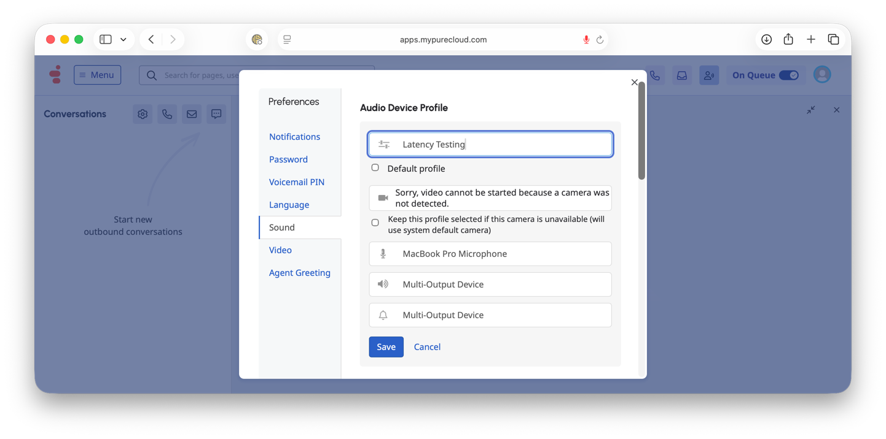

# Manual Test Directions: Cross-System Latency Measurement

Measure true end-to-end latency from spoken audio to Genesys transcription delivery using poc-deepgram as a ground-truth audio clock.

---

## One-Time Setup: BlackHole Audio Routing

BlackHole creates a virtual audio device that routes system audio into poc-deepgram so it can timestamp when speech actually occurs.

### 1. Install BlackHole

```bash
brew install blackhole-2ch
```

### 2. Restart Core Audio (required for macOS to detect the new driver)

```bash
sudo killall coreaudiod
```

> `sudo launchctl kickstart -kp system/com.apple.audio.coreaudiod` is an alternative but fails when SIP is enabled. `killall` works reliably — macOS auto-restarts the daemon.

### 3. Create Multi-Output Device

1. Open **Audio MIDI Setup** (Spotlight → "Audio MIDI Setup")
2. Click the **+** button in the bottom-left corner
3. Select **Create Multi-Output Device**
4. Check both:
   - Your speakers or headphones (so you can still hear the call)
   - **BlackHole 2ch** (routes audio to the virtual input)

### 4. Set System Output

1. In **System Settings → Sound → Output**, select the **Multi-Output Device** you just created
2. Alternatively, Option-click the volume icon in the menu bar and select it there


You now hear the call audio AND it routes to BlackHole for poc-deepgram to capture.

### 5. Configure Browser and Genesys Cloud

**Use Chrome for Genesys** — Safari's WebRTC implementation causes "Not Responding" errors when answering calls, even with correct audio device settings. Chrome handles WebRTC audio device negotiation reliably.

1. Open **Chrome** and navigate to `apps.mypurecloud.com`
2. When Chrome prompts for microphone access, select **MacBook Pro Microphone**
3. In Genesys Cloud, go to **Preferences → Sound → Audio Device Profile**
4. Create a profile (e.g., "Latency Testing") or edit the existing one:
   - **Microphone**: MacBook Pro Microphone
   - **Speaker**: Multi-Output Device
   - **Ringer**: Multi-Output Device
5. Click **Save**



During an active call, you can switch profiles via the **Preferences for Interactions** panel. Select the "Latency Testing" profile (or "Use Computer settings" as a fallback):


The GIF below shows the full Genesys setup flow during a connected call:


**Verified working configuration:**
- **macOS System Input**: MacBook Pro Microphone (your voice → Genesys)
- **macOS System Output**: Multi-Output Device (call audio → speakers + BlackHole)
- **Chrome** (Genesys): microphone set to MacBook Pro Microphone
- **Any browser** (poc-deepgram at `localhost:8766`): audio source dropdown set to BlackHole 2ch

This configuration allows answering Genesys calls in Chrome while poc-deepgram captures the call audio via BlackHole for ground-truth timestamping.

---

## Before Each Test Call

### 6. Start notifications-spike (Terminal 1)

```bash
cd ~/PycharmProjects/notifications-spike
uv run uvicorn main:app --host 0.0.0.0 --port 8765
```

Wait for: `WebSocket connected (agents=N, max_concurrent_conversations=10)`

### 7. Start EventBridge SQS consumer (Terminal 2)

```bash
cd ~/PycharmProjects/notifications-spike
export SQS_QUEUE_URL="https://sqs.us-east-2.amazonaws.com/765425735388/genesys-transcription-latency-test"
export AWS_PROFILE="765425735388_admin-role"
uv run python -m scripts.sqs_consumer
```

Wait for: `Polling SQS queue: ...`

> **AWS Profile**: You **must** use the `765425735388_admin-role` profile. The SSO role in account 173078698674 is blocked by Organization SCP `p-kfhxcsd9`. If auth fails, run: `aws sso login --profile 765425735388_admin-role`

Both notifications-spike (WebSocket) and the SQS consumer (EventBridge) capture the same conversations simultaneously — same conversation IDs appear in both `conversation_events/` and `EventBridge/conversation_events/`.

### 8. Start poc-deepgram (Terminal 3)

```bash
cd ~/PycharmProjects/poc-deepgram
uv run uvicorn poc_deepgram.app:create_app --factory --host 0.0.0.0 --port 8766
```

### 9. Open poc-deepgram in browser

Navigate to **http://localhost:8766**

### 10. Select BlackHole as audio input

In the **audio source dropdown** at the top of the poc-deepgram page (next to the Start button), select **BlackHole 2ch**.

> **Important**: Your macOS **System Settings → Sound → Input** should still be your physical microphone (not BlackHole). The dropdown in the browser is separate from the system input. BlackHole only carries system audio output — it does not carry your mic voice.

### 11. Click Start

Click the **Start** button in the poc-deepgram browser UI. The status indicator should turn green (Connected).

---

## During the Call

### 12. Take the Genesys call normally

Both systems capture data in parallel — no action needed from you during the call:

- **notifications-spike** receives Genesys transcription events via WebSocket and writes them to `conversation_events/<conversation-id>.jsonl`
- **EventBridge SQS consumer** polls SQS for EventBridge-delivered transcription events and writes to `EventBridge/conversation_events/<conversation-id>.jsonl`
- **poc-deepgram** captures the call audio via BlackHole, sends it to Deepgram, and timestamps each utterance with wall-clock time

---

## After the Call

### 13. Stop poc-deepgram

Click **Stop** in the poc-deepgram browser UI. This saves the session JSON to `~/PycharmProjects/poc-deepgram/results/`.

### 14. Identify your output files

```bash
# Most recent Deepgram session
ls -lt ~/PycharmProjects/poc-deepgram/results/ | head -3

# Most recent Genesys conversation (Notifications WebSocket)
ls -lt ~/PycharmProjects/notifications-spike/conversation_events/ | head -3

# Most recent EventBridge conversation (SQS consumer)
ls -lt ~/PycharmProjects/notifications-spike/EventBridge/conversation_events/ | head -3
```

### 15. Cross-check EventBridge conversation IDs

Verify the same conversation IDs appear in both Notifications and EventBridge output directories:

```bash
# Compare conversation IDs between the two paths
diff <(ls conversation_events/ | sort) <(ls EventBridge/conversation_events/ | sort)
```

If a conversation is missing from one path, check terminal logs for errors.

### 16. Run the correlation tool

```bash
cd ~/PycharmProjects/notifications-spike

uv run python -m scripts.correlate_latency \
  --deepgram ../poc-deepgram/results/<SESSION_FILE>.json \
  --genesys conversation_events/<CONVERSATION_ID>.jsonl
```

Replace `<SESSION_FILE>` and `<CONVERSATION_ID>` with the actual filenames from step 14.

### Output

The tool prints:
- Number of matched utterance pairs
- Mean, median, min, max latency
- p95 and p99 latency
- Per-channel breakdown (INTERNAL vs EXTERNAL)
- A table of each matched pair with latency and text similarity score

CSV results are exported to `analysis_results/cross_system/correlation.csv`.

### 17. (Optional) Interactive analysis — Notifications only

For deeper analysis with visualizations (Notifications path only):

```bash
cd ~/PycharmProjects/notifications-spike/notebooks
uv run jupyter notebook cross_system_latency-01-RESULTS.ipynb
```

Select the session files in the notebook and run all cells.

### 18. (Optional) Interactive analysis — EventBridge vs Notifications comparison

For head-to-head comparison of EventBridge and Notifications delivery latency:

```bash
cd ~/PycharmProjects/notifications-spike/notebooks
uv run jupyter notebook cross_system_latency-02-EB-RESULTS.ipynb
```

This notebook correlates both delivery paths against Deepgram ground truth and produces a comparison table, hop analysis, and visualizations.

---

## Troubleshooting

### BlackHole not appearing in Audio MIDI Setup

Restart the Core Audio daemon and reopen Audio MIDI Setup:

```bash
sudo killall coreaudiod
```

> `sudo launchctl kickstart -kp system/com.apple.audio.coreaudiod` does not work when SIP is enabled. Use `killall` instead — macOS auto-restarts the daemon.

### Genesys "Not Responding" when answering calls

**Root cause**: Safari's WebRTC implementation does not reliably negotiate audio devices, especially with virtual devices like Multi-Output Device. Calls connect but immediately show "Not Responding".

**Fix**: Use **Chrome** for Genesys instead of Safari.

If the issue persists in Chrome:
1. Set system output back to **MacBook Pro Speakers** (not Multi-Output Device)
2. Quit and reopen Chrome
3. Navigate to `apps.mypurecloud.com` and try answering a call
4. If that works, switch system output back to **Multi-Output Device** and refresh the Genesys page — Chrome should re-detect the devices

**Chrome microphone settings**: Go to `chrome://settings/content/microphone` and verify it's set to **MacBook Pro Microphone**. You can also click the lock icon in the address bar next to `apps.mypurecloud.com` → **Site settings** → verify Microphone is **Allow**.

### No audio in poc-deepgram

- Verify system output is set to **Multi-Output Device** (not just MacBook Pro Speakers) — BlackHole only receives audio routed through the Multi-Output Device
- In the poc-deepgram browser UI, verify the **audio source dropdown** is set to **BlackHole 2ch** (not your physical microphone)
- Check that the Genesys call audio is playing through system audio (not a USB headset that bypasses system routing)
- Make sure a call is active — BlackHole receives silence when no audio is playing through the system output

### Genesys doesn't hear my voice

- Check **System Settings → Sound → Input** — must be **MacBook Pro Microphone** (not BlackHole)
- Check the Genesys Audio Device Profile — Microphone must be **MacBook Pro Microphone**
- BlackHole only carries system output audio, not microphone input — your voice goes through the physical mic directly to Genesys

### Fallback: Open mic approach (if BlackHole causes issues)

If the Multi-Output Device breaks Genesys audio:
1. Set system output to **MacBook Pro Speakers** (no Multi-Output Device)
2. Set system input to **MacBook Pro Microphone**
3. In Genesys, use **Default profile** or **Use Computer Settings**
4. In poc-deepgram, select **MacBook Pro Microphone** as the audio source (not BlackHole)
5. Turn speaker volume up so the mic picks up both your voice and the call audio

This is less clean (ambient noise) but works without any virtual audio device configuration.

### No matched utterances in correlation

- Lower the similarity threshold: `--threshold 0.4`
- Check that both files cover the same call (overlapping time windows)
- Verify poc-deepgram captured audio (check that the session JSON has transcripts)

### notifications-spike not capturing the conversation

- Confirm the agent on the call is listed in `agents.txt`
- Check the terminal for `Subscribed to transcripts for conversation` log messages
- Verify the `.env` file has correct Genesys credentials

### SQS consumer not capturing events

- Verify the consumer is running: you should see `Polling SQS queue:` in the terminal
- Check AWS auth: `aws sso login --profile 765425735388_admin-role`
- Verify messages exist: `aws sqs get-queue-attributes --queue-url $SQS_QUEUE_URL --attribute-names ApproximateNumberOfMessages --profile 765425735388_admin-role`
- If messages are sitting in SQS but not consumed, restart the consumer

---

## What This Measures

The **true latency** captures the full Genesys transcription pipeline — from the moment words are spoken to when the transcribed text arrives at our application. We measure two delivery paths:

```
Notifications API (WebSocket) Delivery Path:
Speaker → [1] Audio Capture → [2] r2d2 STT → [3] Endpointing
  → [4a] WebSocket notification delivered to notifications-spike

EventBridge (SQS) Delivery Path:
Speaker → [1] Audio Capture → [2] r2d2 STT → [3] Endpointing
  → [4b-i] EventBridge publish → [4b-ii] EB rule → SQS enqueue → [4b-iii] Consumer polls
```

Stages 1-3 are shared. Stage 4 is the delivery mechanism under comparison.

### Pipeline Stages

**Stage 1 — Audio Capture**: Genesys receives the raw audio stream from the call. This includes network transport from the caller's phone/WebRTC client to Genesys Cloud infrastructure.

**Stage 2 — STT Processing**: The Genesys r2d2 engine converts audio to text. This includes acoustic model inference, language model scoring, and word-level confidence/timing computation.

**Stage 3 — Endpointing**: Genesys holds partial transcripts until it determines the speaker has finished an utterance. This is the biggest variable — Genesys may combine multiple sentences into a single `isFinal=true` event, adding wait time but producing more complete transcripts. Deepgram typically endpoints faster (300ms silence threshold), which is why it splits utterances that Genesys combines.

**Stage 4 — WebSocket Delivery**: The final transcript event is pushed through the Genesys notifications API WebSocket channel to notifications-spike. This includes serialization, routing through Genesys infrastructure, and network latency to your machine.

### Formula

```
True Latency = genesys_receivedAt - deepgram_audio_wall_clock_end
```

| Component | Source | Meaning |
|---|---|---|
| `deepgram_audio_wall_clock_end` | poc-deepgram | Wall-clock time when the last word was spoken (ground truth via BlackHole audio capture) |
| `genesys_receivedAt` | notifications-spike | Wall-clock time when the Genesys transcription event arrived via WebSocket |
| **True Latency** | Correlation tool | Sum of all 4 stages above |

Both apps use `time.time()` on the same machine — no clock synchronization issues.

### Interpreting Results

- **Latency under 1s**: Excellent — Genesys pipeline is fast for this utterance
- **Latency 1-2s**: Typical — most of the delay is likely endpointing (Stage 3)
- **Latency 2-5s**: Genesys likely combined multiple sentences into one final event, adding endpointing delay
- **Latency over 5s**: Investigate — could indicate Genesys infrastructure delays or very long utterances

The correlation tool matches utterances between systems using fuzzy text similarity. A similarity score of 1.0 means exact match; scores below 0.55 are rejected. Partial matches (0.55-0.85) often indicate Genesys combined multiple Deepgram utterances into one event.

### Tips for Longer Test Calls

- **2+ minutes of active conversation** gives enough utterances for meaningful p50/p95/p99 statistics
- **Both speakers talking** produces INTERNAL (agent) and EXTERNAL (customer) channel data for comparison
- **Natural pauses between sentences** help both systems endpoint similarly, improving match rates
