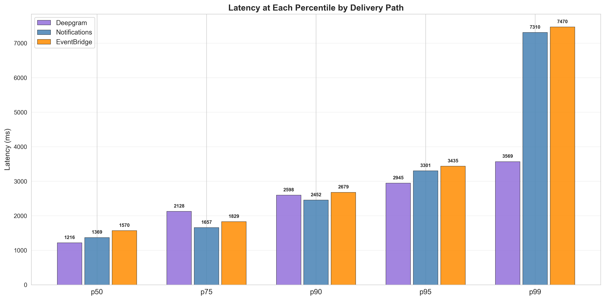
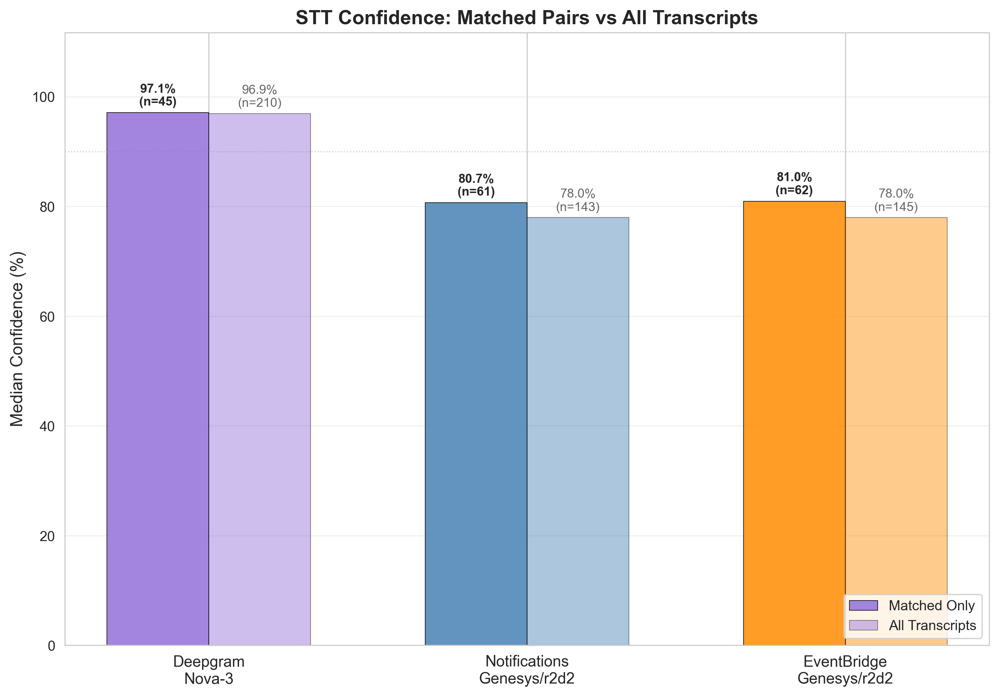
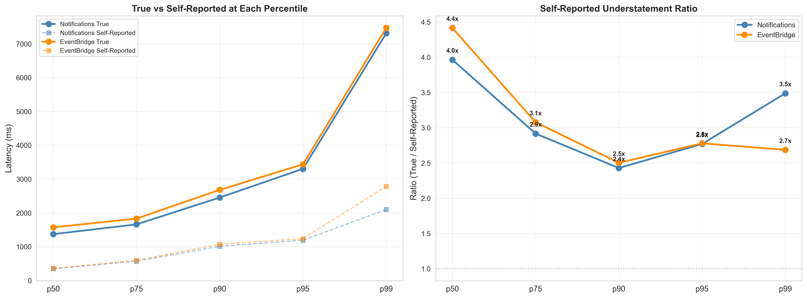
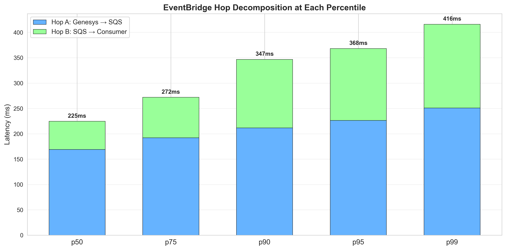
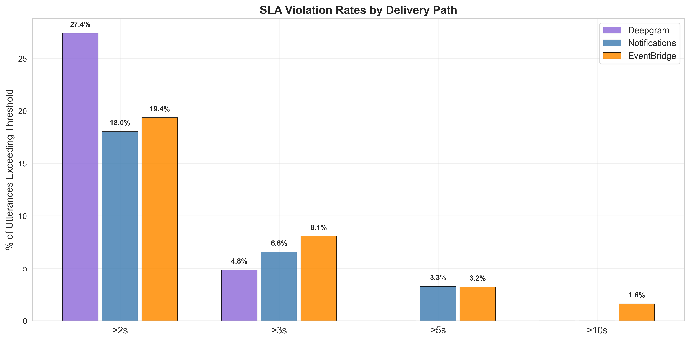
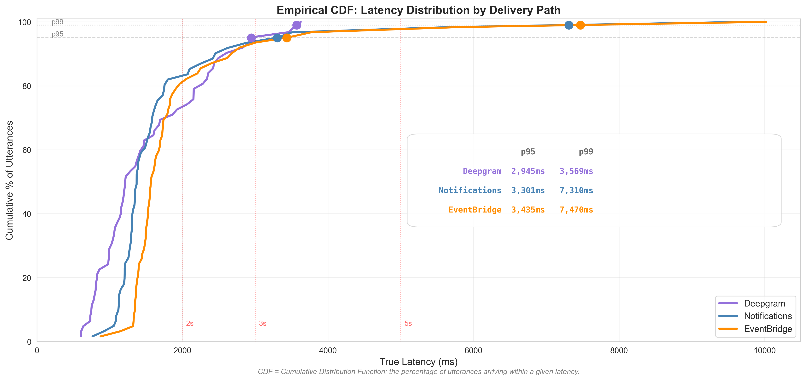

# Transcription Delivery Path Analysis

**Date**: March 23, 2026
**Scope**: Latency and confidence comparison of four transcription delivery paths.
**Target System**: ~1,200 agents, ~40,000 calls/day, ~6-minute average call duration (~800,000 utterances/day).
**Test Data**: 6 live test calls, 61-62 matched utterance pairs per path, independent ground-truth audio timing on a single machine [1].

---

## Summary

### Utterance Latency (end-to-end: speech ended → transcript received) [1]

| Source | p99 | p95 | p50 | >5s rate | >5s/day | STT Confidence |
|--------|:---:|:---:|:---:|:--------:|:-------:|:--------------:|
| **Genesys AudioHook + Deepgram (est. from official docs)** | **~3,500 ms** | **~2,870 ms** | **~1,140 ms** | **~0%** | **~0** | **98%** |
| Deepgram Direct (measured) | 3,569 ms | 2,945 ms | 1,216 ms | 0.0% | 0 | 98% |
| Genesys Notifications WS | 7,310 ms | 3,301 ms | 1,369 ms | 3.3% | ~26,400 | 78% |
| Genesys EventBridge SQS | 7,470 ms | 3,435 ms | 1,570 ms | 3.2% | ~25,600 | 78% |

Genesys AudioHook estimates are derived from Deepgram Direct POC measurements adjusted for Genesys self-reported infrastructure overhead. Previous analysis showed Genesys reported values to be significantly lower than testing observed [9]. Validation requires an end-to-end POC with real Genesys call audio.



The EB-Notifications gap remains constant (134-227ms) across all percentiles [1]. The Deepgram-to-Genesys gap widens at p99, where r2d2 endpointing produces outlier latencies.


### STT Confidence [1]
Confidence is presented as metric indicating accuracy of transcription.

| STT Engine | Median (Matched Pairs) | Median (All Transcripts) |
|------------|:----------------------:|:------------------------:|
| Deepgram Nova-3 | 98.3% | 96.9% |
| Genesys r2d2 | 80.7% | 78.0% |

Confidence is independent of delivery path. Notifications and EventBridge carry identical r2d2 confidence (same STT engine, different delivery).



### Genesys AudioHook Cost

~$68K-$94K/month for Deepgram STT (enterprise discount likely 40-60% off) plus Genesys AudioHook Monitor licensing (contact Genesys sales). Full implementation research: [AudioHook Research](https://grainger.atlassian.net/wiki/spaces/CDA/pages/167125549104/AudioHook+Research) [8].

---

## Method

Three independent capture paths run simultaneously on the same live Genesys call audio [1][2]:

```
Live Genesys Call
    ├─→ Genesys → r2d2 STT → Notifications API (WebSocket) → notifications-spike
    ├─→ Genesys → r2d2 STT → EventBridge → SQS → sqs_consumer
    └─→ BlackHole audio loopback → Deepgram Nova-3 STT → poc-deepgram
```

Path C (Deepgram Direct) provides ground truth. True latency = `receivedAt - audio_wall_clock_end`, both `time.time()` on the same machine. No clock synchronization needed.

Utterances matched across systems using fuzzy text similarity (SequenceMatcher ≥ 0.70) within a 15-second temporal window [3].

**Metric**: All latency percentiles in this document are **per-utterance** unless explicitly labeled per-word.

---

## Self-Reported vs True Latency

Genesys self-reported latency understates true latency by 2.4x-4.4x [1]. Self-reported misses Stage 1 (audio capture transport) and zeros out the baseline via anchor-event timing.

| Percentile | Notifications True | Self-Reported | Ratio | EventBridge True | Self-Reported | Ratio |
|------------|-------------------:|--------------:|------:|-----------------:|--------------:|------:|
| p99 | 7,310 ms | 2,097 ms | 3.5x | 7,470 ms | 2,781 ms | 2.7x |
| p95 | 3,301 ms | 1,192 ms | 2.8x | 3,435 ms | 1,236 ms | 2.8x |
| p50 | 1,369 ms | 346 ms | 4.0x | 1,570 ms | 356 ms | 4.4x |



---

## EventBridge Delivery Overhead

The EB delivery pipeline stays under 350ms at p99 [1]. Tail latency originates in Stages 1-3 (audio capture, r2d2 STT, endpointing).

```
genesysEventTime ──────────────> sqsSentTimestamp ──────────────> receivedAt
       │                                │                              │
       └──────── Hop A ────────────────┘                              │
                Genesys publishes event                               │
                to EventBridge; EB rule                               │
                routes to SQS queue                                   │
                                        └──────── Hop B ─────────────┘
                                                 Consumer long-polls SQS;
                                                 SQS returns immediately
                                                 when a message arrives
```

| Hop | p99 | p95 | p50 |
|-----|----:|----:|----:|
| **Hop A**: Genesys → SQS enqueue | 251 ms | 226 ms | 169 ms |
| **Hop B**: SQS → Consumer poll | 165 ms | 142 ms | 56 ms |
| **Total** | **343 ms** | **325 ms** | **238 ms** |

EB-Notifications delta: +134ms to +227ms across percentiles [1].



---

## SLA Exceedance at Production Scale

**SLA target**: All utterances delivered end-to-end (speech ended → agent sees suggestion) in under 2 seconds. This encompasses Stages 1-6: STT + endpointing + delivery + LLM inference + render.

**SLA exceedance rate** is the percentage of utterances whose true latency exceeds a given threshold. Rates below are for **Stages 1-4 only** (speech ended → transcript received, before LLM inference). LLM inference (Stage 5) adds 500-2,000ms on top of these numbers. Rates are measured from the 61-62 matched pairs and projected to 800,000 utterances/day [1].

At 800,000 utterances/day:

| Source | >2s | >2s/day | >3s | >3s/day | >5s | >5s/day |
|--------|----:|--------:|----:|--------:|----:|--------:|
| Deepgram Direct | 27.4% | ~219,200 | 4.8% | ~38,400 | 0.0% | 0 |
| Genesys Notifications WS | 18.0% | ~144,000 | 6.6% | ~52,800 | 3.3% | ~26,400 |
| Genesys EventBridge SQS | 19.4% | ~155,200 | 8.1% | ~64,800 | 3.2% | ~25,600 |

At a 2s SLA target, Stages 1-4 alone exceed 2 seconds for 18-27% of utterances — before LLM inference begins. With LLM inference added (500-2,000ms), the 2s target is only achievable for utterances where Stages 1-4 complete in under ~1,500ms (approximately p50 and below for all paths).

Tail events appear across multiple conversations. EventBridge tail events track Notifications tail events at the same timestamps with a consistent offset — the tail is caused by r2d2 STT endpointing, not the delivery path [1].





All three paths deliver >80% of utterances within 2 seconds (Stages 1-4 only). Deepgram Direct reaches 100% by 3.6s. Genesys paths have tails extending to 7-10s [1].

---

## Notifications API Constraints at 1,200 Agents

### Hard Limits [10]

| Limit | Value | Source |
|-------|-------|--------|
| Topics per WebSocket channel | 1,000 | Genesys docs (400 error if exceeded) |
| Channels per user/application | 20 | Genesys docs |
| Channel lifetime | 24 hours | Must recreate and resubscribe after expiry |
| WebSocket connections per channel | 1 | Second connection disconnects the first |
| `GET /api/v2/conversations` | Returns current user's conversations only | Empty with `client_credentials` auth |

### Capacity Math [10]

```
  1,200  agent conversation feed topics (static, one per agent)
+   750-1,000  transcription topics (dynamic, at peak concurrency)
─────────
= 1,950-2,200  topics needed simultaneously → 2x the 1,000 limit
```

### Workarounds Required for Production [10]

| Workaround | What It Requires |
|------------|-----------------|
| Channel sharding (3-4 channels) | Routing logic, per-channel topic tracking, rebalancing when one shard nears 1,000 |
| Dynamic topic management | ~80,000 subscribe/unsubscribe API calls/day (40,000 calls × 2 operations) |
| 24-hour channel rotation | Staggered refresh: create new channel → subscribe all topics → connect new WS → verify events → disconnect old WS. Failure during rotation loses all events for that shard |
| Analytics-based recovery | Replace `GET /api/v2/conversations` (broken with `client_credentials`) with `POST /api/v2/analytics/conversations/details/query`. Requires 1,200 user ID predicates per query. ~8,640 additional API calls/day at 10s polling |
| Multi-participant parsing | Iterate ALL agent participants per conversation, not just the first. Required to handle re-routed calls |

### Issues Found During Testing [7]

During a 6-call test with 2 agents, the following issues were discovered. Full details: [Notifications Testing Learnings](https://grainger.atlassian.net/wiki/spaces/CDA/pages/edit-v2/167127121959?draftShareId=398399de-b566-42bb-b067-24953c838cc8) [7].

| # | Issue | Impact | EventBridge Affected? |
|---|-------|--------|:---------------------:|
| 1 | `MAX_CONCURRENT_CONVERSATIONS` defaulted to 1 — silently dropped alternating calls | 3 of 6 conversations lost | No |
| 2 | Startup race condition — calls in progress before WebSocket connects are invisible | First conversation lost | No |
| 3 | SQS consumer not started (operator error, but illustrates multi-process dependency) | All EB data missing for that run | N/A (operator) |
| 5 | Status events without `transcripts` field crash consumer (poison message loop) | Consumer stuck until fix | Fixed (delete non-transcript messages) |
| 6 | `_conversation_times()` stops at first agent participant — re-routed calls missed | Conversation captured by EB but not Notifications | No |
| 7 | State machine stuck after missed call + agent re-ready (`connected=False ended=True` loop) | Conversation captured by EB for 10+ minutes while Notifications shows nothing | No |
| 8 | `recover_active_conversations()` returns nothing — `GET /api/v2/conversations` empty with `client_credentials` auth | Recovery function never worked. Startup recovery was a no-op | No |

Issues 6, 7, and 8 are architectural: the reactive subscribe/unsubscribe model requires per-conversation state tracking that breaks under real-world call routing patterns [7]. EventBridge is unaffected by all of these because it has no per-conversation subscription, no state machine, and delivers all transcription events to a single SQS queue regardless of conversation lifecycle [11].

### EventBridge Comparison [11]

Zero per-agent subscriptions. Zero API calls during steady state. Single EB rule captures all events org-wide. SQS retains messages up to 14 days during consumer downtime [12].

---

## Complexity Comparison [10][11]

| Dimension | EventBridge | Notifications API | AudioHook + Deepgram |
|-----------|:-----------:|:-----------------:|:--------------------:|
| Application code | ~80 lines | ~1,500+ lines | ~500-1,000 lines |
| Genesys API calls/day | 0 | ~88,640 | 0 |
| WebSocket connections | 0 | 3-4 | ~1,000 (one per call) |
| Inbound bandwidth | ~5 Mbps | ~5 Mbps | ~256 Mbps |
| Failure modes | 1 | 7+ | 2+ |
| Recovery from downtime | SQS retains messages [12] | Recreate channels, resubscribe, recover | No recovery for missed audio |
| Additional cost | $0 | $0 | AudioHook license + Deepgram STT |


---

## Latency Budget: Speech Ended → Agent Sees Suggestion [1]

All three paths share Stages 1-3 (Genesys r2d2 STT + endpointing) and Stages 5-6 (LLM + render). They differ only in Stage 4 (delivery).

### Notifications (WebSocket)

```
                                             p95            p99
Stage 1-3: Genesys STT + endpointing     3,301 ms       7,310 ms
Stage 4:   WS delivery                    ~50-200 ms     ~100-250 ms
Stage 5:   LLM inference                  ~500-2,000 ms  ~500-2,000 ms
Stage 6:   Render in agent UI             ~50-100 ms     ~50-100 ms
────────────────────────────────────────────────────────────────────
Total:                                    ~3,900-5,600 ms  ~7,960-9,660 ms
```

### EventBridge (SQS)

```
                                             p95            p99
Stage 1-3: Genesys STT + endpointing     3,435 ms       7,470 ms
Stage 4:   EB delivery (Hop A + Hop B)      325 ms         343 ms
Stage 5:   LLM inference                  ~500-2,000 ms  ~500-2,000 ms
Stage 6:   Render in agent UI             ~50-100 ms     ~50-100 ms
────────────────────────────────────────────────────────────────────
Total:                                    ~4,310-5,860 ms  ~8,363-9,913 ms
```

### AudioHook + Deepgram (estimated)

```
                                             p95            p99
Stage 1-3: Deepgram STT + endpointing    2,945 ms       3,569 ms
Stage 4:   In-process (no network hop)       ~0 ms          ~0 ms
Stage 5:   LLM inference                  ~500-2,000 ms  ~500-2,000 ms
Stage 6:   Render in agent UI             ~50-100 ms     ~50-100 ms
────────────────────────────────────────────────────────────────────
Total:                                    ~3,495-5,045 ms  ~4,119-5,669 ms
```

The delivery path (Stage 4) adds 325-343ms for EventBridge and ~50-250ms for Notifications. At p99, the dominant factor is Stage 1-3: Genesys r2d2 reaches 7,310-7,470ms while Deepgram reaches 3,569ms. The AudioHook path eliminates the r2d2 tail entirely.

---

## References

| # | Source | Description |
|---|--------|-------------|
| 1 | `notebooks/cross_system_latency-03-PERCENTILE-ANALYSIS.ipynb` | Primary percentile analysis: latency (p50-p99), SLA exceedance, confidence, EB hop decomposition, self-reported vs true |
| 2 | `notebooks/cross_system_latency-02-EB-RESULTS.ipynb` | Cross-system median/mean analysis |
| 3 | `scripts/correlate_latency.py` | Utterance matching engine (fuzzy text similarity, SequenceMatcher ≥ 0.70, 15s window) |
| 4 | `analysis_results/cross_system_eb/` and `analysis_results/cross_system_eb_p99/` | Exported charts and data (CSV, JSON, PNG) |
| 7 | https://grainger.atlassian.net/wiki/spaces/CDA/pages/edit-v2/167127121959?draftShareId=398399de-b566-42bb-b067-24953c838cc8 | Notifications Testing Learnings (Confluence) |
| 8 | https://grainger.atlassian.net/wiki/spaces/CDA/pages/167125549104/AudioHook+Research | AudioHook implementation research (Confluence) |
| 9 | https://grainger.atlassian.net/wiki/spaces/CDA/pages/167066828860/Genesys+Notifications+WebSocket+Latency+Experiment+Results | Genesys Notifications WebSocket Latency Experiment Results |
| 10 | https://developer.genesys.cloud/notificationsalerts/notifications/ | Genesys Notifications API documentation (topic limits, channel limits, usage limitations) |
| 11 | https://help.genesys.cloud/articles/about-the-amazon-eventbridge-integration/ | Genesys EventBridge integration documentation |
| 12 | https://docs.aws.amazon.com/AWSSimpleQueueService/latest/SQSDeveloperGuide/quotas-messages.html | AWS SQS message retention limits (4 days default, 14 days max) |
